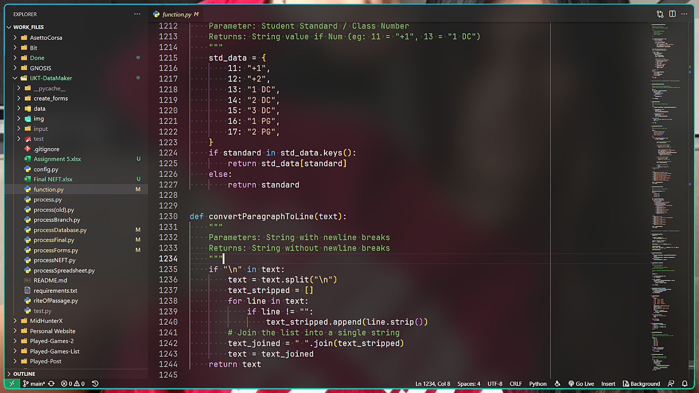

# 🆚 Code OSS (Code Editor)

Code - OSS is an open source project without any proprietary code under the MIT License.
The main problem with VSCode is that, it has no context aware keybindings by default for the keyboard people in the year of 2020.
keybindings.json contains a list of context aware keybindings that I have used during my time in VSCode.  
It also fixes some vim extension key conflicts in order to use the default VSCode keybindings on insert mode and Vim keybindings on normal mode.

## ❌ Problems
- It puts dotfiles on $HOME dir which doesn't follow XDG Spec. [VSCode Issue has been open since 2016](https://github.com/Microsoft/vscode/issues/3884)
- This problem is inherited from Electron, which is inherited from Chrome.
- Electron has has an issue for this: [ electron/electron#8124 ]( https://github.com/electron/electron/issues/8124 ). They seem to be worried about breaking backwards compatibility for every program that uses Electron.
- VSCode is also creating `~/.pki/nssdb` even though NSS has supported XDG since version 3.42

## ⌨️ Keybindings

### When Workbench is Selected

Workbench is selected automatically by default or whenever any other panel is deselected by executing their keybindings again after selection.

| Keymap | Description                 |
| ------ | --------------------------- |
| ctrl+n | New Tab                     |
| ctrl+t | New Tab (Web Browser Style) |
| ctrl+w | Close Tab (Windows Style)   |

### When Explorer Panel is Selected (ctrl+shift+e)

| Keymap       | Description                |
| ------------ | -------------------------- |
| ctrl+n       | New File                   |
| ctrl+shift+n | New Folder (Windows Style) |
| ctrl+shift+d | Delete Files               |

### When Terminal Panel is Selected (ctrl+j)

| Keymap  | Description                  |
| ------- | ---------------------------- |
| shift+n | New Terminal Tab             |
| shift+a | Move forwards Terminal Tabs  |
| shift+b | Move backwards Terminal Tabm |

## ⚙️ Settings

- 80 character limit line.
- Disabled Telemetry.
- VSCode window wallpaper.
- Removes annoying Workbench tips
- Hidden Activity Bar. Clutter free. Pop it up using keybindings.
- Highlights modified tabs
- Settings natural language search
- Disabled close button for tabs. Use Crtl+W bro.
- Default Dark+ set as current theme
- Default Tab Size = 2. Industrial Standard I guess. 4 for Python and HTML.
- Wordwrap on
- Autoformat on save and paste.
- Tab completion. Arrows as well.
- Suggestion gets accepted only if you explicitly selects it with tab.
- Smoooooooth mouse caret.
- Disabled Auto update.
- Enabled Terminal copy on selection.
- Smooth animations with `animation` extension.
- Confetti explosions with `powermode` extension.
- Quality of life settings for `vim` extension.
- Always open "untrusted files"
