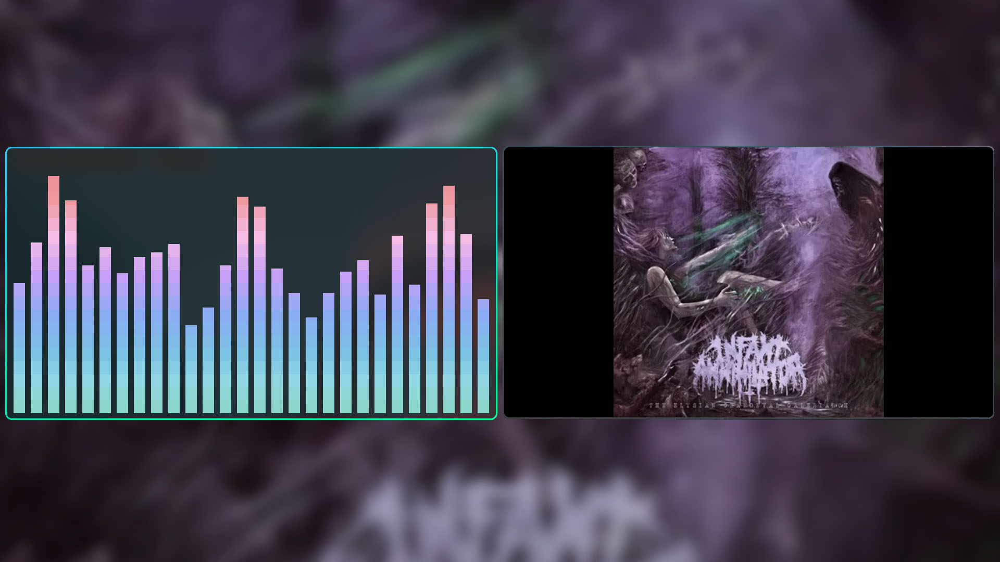

# 📊 CAVA (Music Visualizer)

Cava is a bar spectrum audio visualizer for terminal (ncurses) or desktop (SDL).

This program is not intended for scientific use. It's written to look responsive and aesthetic when used to visualize music.
