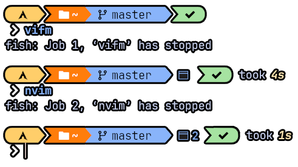
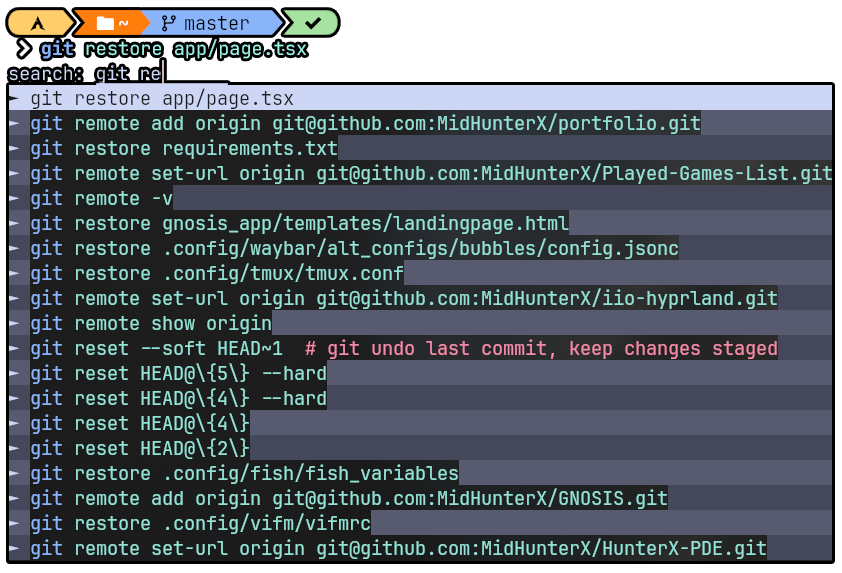
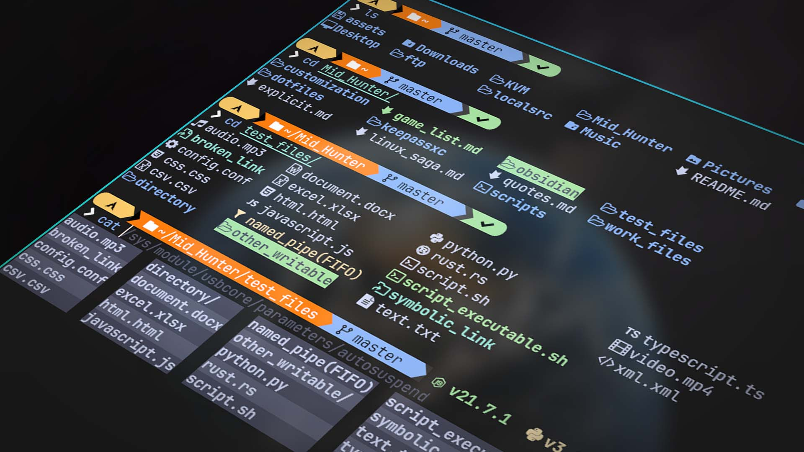

# 🐟 FISH (Shell)

fish is a Unix shell with a focus on interactivity and usability. Fish is designed to give the user features by default, rather than by configuration. Fish is considered an exotic shell since it does not adhere to POSIX shell standards, at the discretion of the maintainers.

## Abbreviated Commands

| Command  | Description                                   |
| -------- | --------------------------------------------- |
| yeet     | Remove Packages along with their Dependencies |
| woman    | Yapping all possible Man pages                |
| sayonara | Shutdown Computer                             |
| brs      | Set Brightness                                |
| vos      | Set System Volume                             |
| cls      | Clear Terminal Screen (`CTRL + L`)            |

### Semantic Commands

| Command        | Description                                          |
| -------------- | ---------------------------------------------------- |
| fe, fetch      | System Info Fetch                                    |
| gi, git        | Lazygit TUI                                          |
| gife, gitfetch | Git Info Fetch                                       |
| vm             | VIFM File Manager                                    |
| vc             | VIFM CD Mode                                         |
| in             | [Intention](https://github.com/MidHunterX/Intention) |

## Move Terminal Apps to BG and FG

- Press `CTRL + Z` when inside terminal app to move it to Background.
- Press `CTRL + Z` inside terminal prompt to move BG app to Foreground.

The number of background apps will be shown in prompt as shown.

## Auto Complete based on CMD History

- Go to Normal Mode and search using `/`

## Better LS and CD navigation

- Install **lsd** and **bat** for the NerdFont goodness.
- Navigate using **ls** and **cd** with much better comfortability.

## Edit Shell Prompt Input with NeoVim

- Press `Alt + e` on Insert mode to edit shell prompt input inside Neovim

## Extra Functionalities

- `Alt + e` to edit shell prompt input inside Neovim
- Auto Pair brackets and quotes
- Clean out bad CMD History
