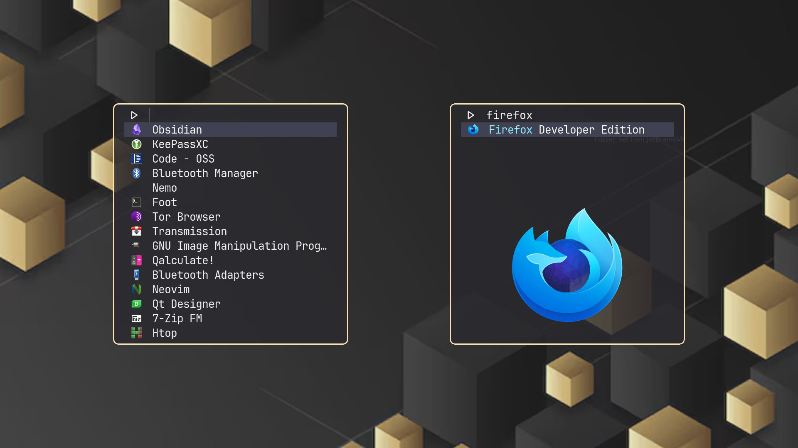

# 📜 FUZZEL (App Launcher)

Fuzzel is a Wayland-native application launcher, similar to rofi's drun mode.

## Default Features:

Wayland native
Rofi drun-like mode of operation
dmenu mode where newline separated entries are read from stdin
Emacs key bindings
Icons!
Remembers frequently launched applications
