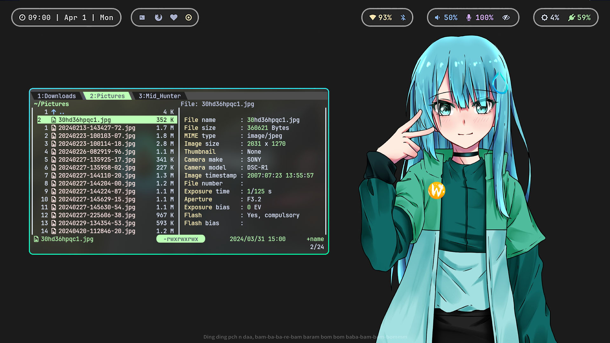

# 💧 Hyprland (Wayland Compositor)

Hyprland is a dynamic tiling Wayland compositor based on wlroots that doesn't sacrifice on its looks.

It provides the latest Wayland features, is highly customizable, has all the eyecandy, the most powerful plugins, easy IPC, much more QoL stuff than other wlr-based compositors.

Default Features:
- Eyecandy Customization: gradient borders, blur, animations, shadows etc.
- Custom bezier curves for the best animations
- Powerful plugin support and Built-in plugin manager
- Tearing support for better gaming performance
- Not afraid to provide bleeding-edge features
- Config reloaded instantly upon saving
- Fully dynamic workspaces
- Two built-in layouts and more available as plugins
- Uses forked wlroots with QoL patches
- Global keybinds passed to your apps of choice
- Tiling/pseudotiling/floating/fullscreen windows
- Special workspaces (scratchpads)
- Window groups (tabbed mode)
- Powerful window/monitor/layer rules
- Socket-based IPC
- Native IME and Input Panels Support
