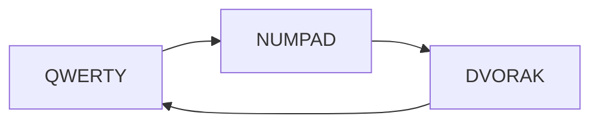

# 🎹 KEYD (System Wide Key Remapping Daemon)

Linux lacks a good key remapping solution. In order to achieve satisfactory
results a medley of tools need to be employed (e.g xcape, xmodmap) with the end
result often being tethered to a specified environment (X11). keyd attempts to
solve this problem by providing a flexible system wide daemon which remaps keys
using kernel level input primitives (evdev, uinput).

## 🏠 Home Row Mods (GCAS)

Homerow modifiers are activated by overloading the specific key assigned to it.

<table>
<tr><th>Layout</th><th>Left Hand</th><th>Right Hand</th></tr>
<tr><td>QWERTY</td><td>

| a    | s    | d   | f     |
| ---- | ---- | --- | ----- |
| Meta | Ctrl | Alt | Shift |

</td><td>

| j     | k   | l    | ;    |
| ----- | --- | ---- | ---- |
| Shift | Alt | Ctrl | Meta |

</td></tr>
<tr><td>DVORAK</td><td>

| a    | o    | e   | u     |
| ---- | ---- | --- | ----- |
| Meta | Ctrl | Alt | Shift |

</td><td>

| h     | t   | n    | s    |
| ----- | --- | ---- | ---- |
| Shift | Alt | Ctrl | Meta |

</td></tr>
</table>

- `Shift` is assigned to `Index finger` as it's the most used key & finger.
- `Alt` is assigned to `Middle finger` because it's the least used key
  assigned to the most dangerous key 'D'.
- `Ctrl` is assigned to `Ring finger` as it's the next strongest finger other
  than Middle finger. Not only that, Ring finger is the most used finger in
  combination with Ctrl.
- `Meta` is assigned to `Pinkie` due to familiarity (because the same finger is
  used to activate that key otherwise).

## 🚀 Space Layer

Space layer is activated by overloading space key. Then press the keys below to
activate space layer remaps.

| Key | Output Key             |
| --- | ---------------------- |
| i   | Enter                  |
| h   | Left                   |
| j   | Down                   |
| k   | Up                     |
| l   | Right                  |
| e   | Move to End of Word    |
| b   | Move One Word Backward |
| u   | Move to Front of Line  |
| d   | Move to End of Line    |
| ;   | Backspace              |

Note: Backspace also works in homerow Ctrl layer as well

## 🎹 KeyD Keybindings

- Escape = f+j (chorded < 50ms)
- Escape = CapsLock (Click < 300ms)
- Ctrl = CapsLock (Press < 300ms with other Key)
- CapsLock = CapsLock (Press > 300ms)

## 🍇 Meta Keymap Toggle

### Meta + Space

Meta + Space is the same keybinding Windows use to cycle between multiple layouts as well.



### QWERTY Layer


<table>
<tr><th>Normal Layer</th><th>Shift Layer</th></tr>
<tr><td>

```
1 2 3 4 5 6 7 8 9 0 - =
 q w e r t y u i o p [ ] \
  a s d f g h j k l ; '
   z x c v b n m , . /
```

</td><td>

```
! @ # $ % ^ & * ( ) _ +
 Q W E R T Y U I O P { } |
  A S D F G H J K L : "
   Z X C V B N M < > ?
```

</td></tr>
</table>

### NUMPAD Layer

<table>
<tr><th>Normal Layer</th><th>Shift Layer</th></tr>
<tr><td>

```
- F1 F2 F3 F4 F5 F6 F7 F8 F9
 - - - - - - 7 8 9 - - - -
  - - - - - - 4 5 6 - -
   - - - - - 0 1 2 3 .
```

</td><td>

```
- F1 F2 F3 F4 F5 F6 F7 F8 F9
 - - - - - - & * ( - - - -
  - - - - - - $ % ^ - -
   - - - - - ) ! @ # .
```

</td></tr>
</table>

### DVORAK Layer

<table>
<tr><th>Normal Layer</th><th>Shift Layer</th></tr>
<tr><td>

```
1 2 3 4 5 6 7 8 9 0 [ ]
 ' , . p y f g c r l / = \
  a o e u i d h t n s -
   ; q j k x b m w v z
```

</td><td>

```
! @ # $ % ^ & * ( ) { }
 " < > P Y F G C R L ? + |
  A O E U I D H T N S _
   : Q J K X B M W V Z
```

</td></tr>
</table>
