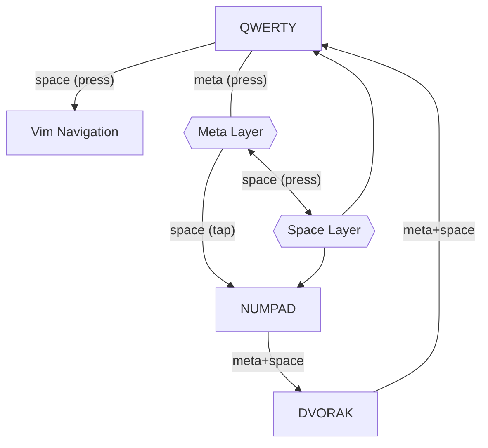

# 🎹 KEYD (System Wide Key Remapping Daemon)

Linux lacks a good key remapping solution. In order to achieve satisfactory
results a medley of tools need to be employed (e.g xcape, xmodmap) with the end
result often being tethered to a specified environment (X11). keyd attempts to
solve this problem by providing a flexible system wide daemon which remaps keys
using kernel level input primitives (evdev, uinput).

> [!NOTE]
> For detailed data on ergonomic analysis of different keyboard layouts, use: [cyanophage](https://cyanophage.github.io/).
> It gives you access to data like: Finger usage, Finger distance, Column & Row usage, Same finger Bigram & Trigrams etc.

## 🏠 Home Row Mods (GCAS)

Homerow modifiers are activated by overloading the specific key assigned to it.

<table>
<tr><th>Layout</th><th>Left Hand</th><th>Right Hand</th></tr>
<tr><td>QWERTY</td><td>

| a    | s    | d   | f     |
| ---- | ---- | --- | ----- |
| Meta | Ctrl | Alt | Shift |

</td><td>

| j     | k   | l    | ;    |
| ----- | --- | ---- | ---- |
| Shift | Alt | Ctrl | Meta |

</td></tr>
<tr><td>DVORAK</td><td>

| a    | o    | e   | u     |
| ---- | ---- | --- | ----- |
| Meta | Ctrl | Alt | Shift |

</td><td>

| h     | t   | n    | s    |
| ----- | --- | ---- | ---- |
| Shift | Alt | Ctrl | Meta |

</td></tr>
</table>

- `Shift` is assigned to `Index finger` as it's the most used key & finger.
- `Alt` is assigned to `Middle finger` because it's the least used key
  assigned to the most dangerous key 'D'.
- `Ctrl` is assigned to `Ring finger` as it's the next strongest finger other
  than Middle finger. Not only that, Ring finger is the most used finger in
  combination with Ctrl.
- `Meta` is assigned to `Pinkie` due to familiarity (because the same finger is
  used to activate that key otherwise).

## 🚀 Space Layer

**Vim Navigation** is activated by overloading space key in QWERTY Layer. Then
press the keys below to activate space layer remaps.

**Numpad Layer** is activated by overloading space key in QWERTY > Meta Layer.

<table>
<tr><th>Vim Navigation</th><th>Numpad Layer</th></tr>
<tr><td>

| Key | Output Key             |
| --- | ---------------------- |
| i   | Enter                  |
| h   | Left                   |
| j   | Down                   |
| k   | Up                     |
| l   | Right                  |
| e   | Move to End of Word    |
| b   | Move One Word Backward |
| u   | Move to Front of Line  |
| d   | Move to End of Line    |
| ;   | Backspace              |

</td><td>

<table>
<tr><th>Normal Layer</th></tr>
<tr><td>

```
- F1 F2 F3 F4 F5 F6 F7 F8 F9
 - - - - - - 7 8 9 - - - -
  - - - - - - 4 5 6 - -
   - - - - - 0 1 2 3 .
```

</td></tr>
<th>Shift Layer</th>
<tr><td>

```
- F1 F2 F3 F4 F5 F6 F7 F8 F9
 - - - - - - & * ( - - - -
  - - - - - - $ % ^ - -
   - - - - - ) ! @ # .
```

</td></tr>
</table>
</td></tr>
</table>

## 🎹 Keybindings

- f+j (chorded < 50ms) = **Escape**
- CapsLock (**Tap** < 300ms) = **Escape**
- CapsLock (**Press** < 300ms + another Key) = **Ctrl**
- CapsLock (**Press** > 300ms) = **CapsLock**

## 🎡 Layer Topology

Meta + Space is the same keybinding Windows use to cycle between multiple layouts as well.
Here, **Press** = Temporary Layer Switch and **Tap** = Permanent Layer Toggle.



TIP: You can get NUMPAD with overloading space only if you do the following sequence: Meta down -> Space down -> Meta up. Now you are in the Space Layer which points to NUMPAD, inside the Meta Layer inside the QWERTY Layer which will go back to QWERTY layer when you do Space up.
