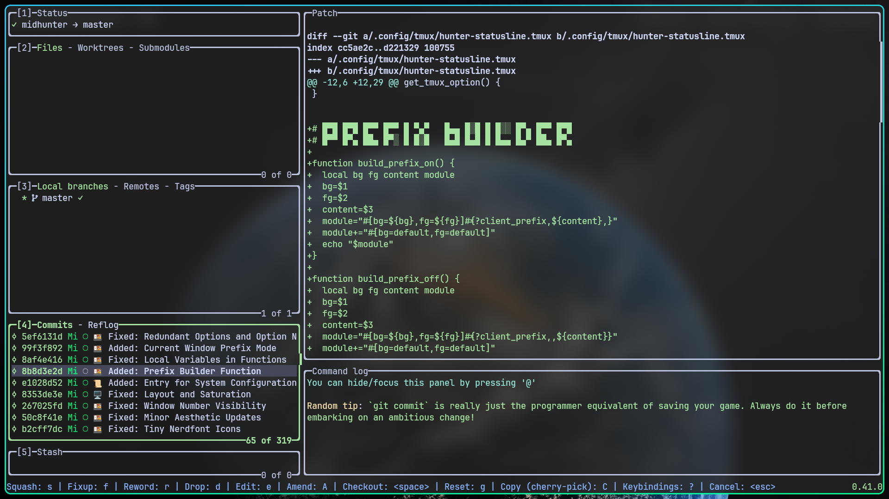

# LazyGit (git TUI Frontend)

A simple terminal UI for git commands

## Default Features

### Stage individual lines

Press space on the selected line to stage it, or press `v` to start selecting a range of lines. You can also press `a` to select the entirety of the current hunk.

### Interactive Rebase

Press `i` to start an interactive rebase. Then squash (`s`), fixup (`f`), drop (`d`), edit (`e`), move up (`ctrl+i`) or move down (`ctrl+j`) any of TODO commits, before continuing the rebase by bringing up the rebase options menu with `m` and then selecting `continue`.

You can also perform any these actions as a once-off (e.g. pressing `s` on a commit to squash it) without explicitly starting a rebase.

### Cherry-pick

Press `shift+c` on a commit to copy it and press `shift+v` to paste (cherry-pick) it.

### Bisect

Press `b` in the commits view to mark a commit as good/bad in order to begin a git bisect.

### Nuke the working tree

For when you really want to just get rid of anything that shows up when you run `git status` kidpix style, press `shift+d` to bring up the reset options menu and then select the 'nuke' option.

### Amend an old commit

Pressing `shift+a` on any commit will amend that commit with the currently staged changes (running an interactive rebase in the background).

### Filter

You can filter a view with `/`. Here we filter down our branches view and then hit `enter` to view its commits.

### Worktrees

You can create worktrees to have multiple branches going at once without the need for stashing or creating WIP commits when switching between them. Press `w` in the branches view to create a worktree from the selected branch and switch to it.

### Rebase magic (custom patches)

You can build a custom patch from an old commit and then remove the patch from the commit, split out a new commit, apply the patch in reverse to the index, and more.

In this example we have a redundant comment that we want to remove from an old commit. We hit `<enter>` on the commit to view its files, then `<enter>` on a file to focus the patch, then `<space>` to add the comment line to our custom patch, and then `ctrl+p` to view the custom patch options; selecting to remove the patch from the current commit.

### Rebase from marked base commit

Say you're on a feature branch that was itself branched off of the develop branch, and you've decided you'd rather be branching off the master branch. You need a way to rebase only the commits from your feature branch. In this demo we check to see which was the last commit on the develop branch, then press `shift+b` to mark that commit as our base commit, then press `r` on the master branch to rebase onto it, only bringing across the commits from our feature branch. Then we push our changes with `shift+p`.

### Undo

You can undo the last action by pressing 'z' and redo with `ctrl+z`. Here we drop a couple of commits and then undo the actions.
Undo uses the reflog which is specific to commits and branches so we can't undo changes to the working tree or stash.

### Commit graph

When viewing the commit graph in an enlarged window (use `+` and `_` to cycle window sizes), the commit graph is shown. Colours correspond to the commit authors, and as you navigate down the graph, the parent commits of the selected commit are highlighted.

### Compare two commits

If you press `shift+w` on a commit (or branch/ref) a menu will open that allows you to mark that commit so that any other commit you select will be diffed against it. Once you've selected the second commit, you'll see the diff in the main view and if you press `<enter>` you'll see the files of the diff. You can press `shift+w` to view the diff menu again to see options like reversing the diff direction or exiting diff mode. You can also exit diff mode by pressing `<escape>`.
