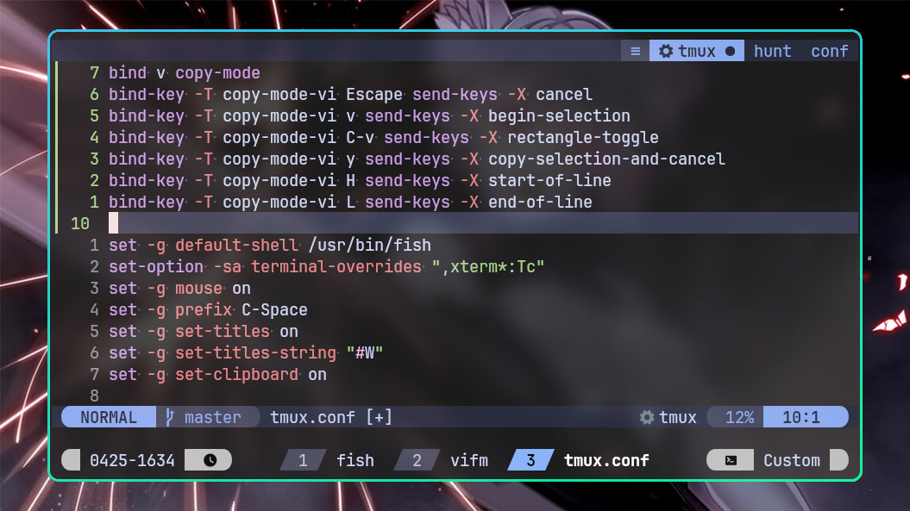

# 🍱 TMUX (Terminal Multiplexer)

tmux is an open-source terminal multiplexer for Unix-like operating systems. It
allows multiple terminal sessions to be accessed simultaneously in a single
window. It is useful for running more than one command-line program at the same
time. It can also be used to detach processes from their controlling terminals,
allowing remote sessions to remain active without being visible.

## TMUX Keybindings

| Keymap  | Description       |
| ------- | ----------------- |
| C-Space | Prefix Mode       |
| v       | Copy Mode         |
| C-h     | Select Pane Left  |
| C-j     | Select Pane Down  |
| C-k     | Select Pane Up    |
| C-l     | Select Pane Right |

## Prefix Mode Keybindings

| Keymap | Description        |
| ------ | ------------------ |
| n      | Next Window        |
| p      | Previous Window    |
| x      | Close Window       |
| sv     | Split Vertically   |
| sh     | Split Horizontally |
| t      | Show Time          |
| w      | Window Preview     |

## Copy Mode Keybindings

| Keymap | Description             |
| ------ | ----------------------- |
| v      | Selection               |
| C-v    | Block Selection         |
| H      | Go to start of Line     |
| L      | Go to end of Line       |
| y      | Yank and Exit Copy Mode |
| Esc    | Exit Copy Mode          |
