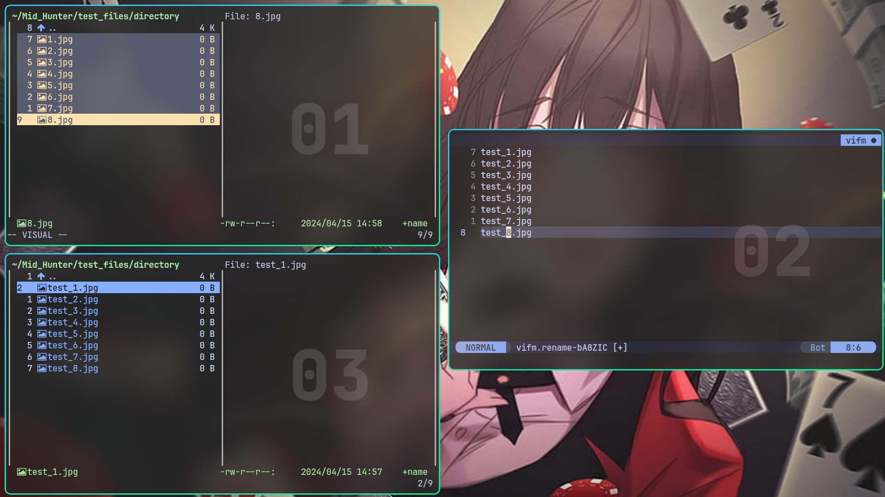

# 📁 File Manager (vifm)

Vifm is a file manager with curses interface, which provides Vim-like environment for managing objects within file systems, extended with some useful ideas from mutt. If you use vi, Vifm gives you complete keyboard control over your files without having to learn a new set of commands.

## VIFM Keybindings

| Keymap   | Description              |
| -------- | ------------------------ |
| rr       | Opens random media file  |
| rv       | Opens random video file  |
| Ctrl + f | Fuzzy Find Files         |
| ?        | Fuzzy Find Files         |
| /        | Fast Navigation Mode     |
| Ctrl + o | Go Backward History      |
| Ctrl + i | Go Forward History       |
| o        | Open With                |
| t        | touch File               |
| M        | mkdir Directory          |
| i        | Execute Files/Directory  |
| a        | Rename Filename          |
| A        | Rename Filename + Ext    |
| cw       | Rename Filename          |
| cW       | Rename Filename + Ext    |
| Ctrl + u | Scroll Page Up           |
| Ctrl + d | Scroll Page Down         |
| u        | Undo                     |
| U        | Redo                     |
| H        | Move to Left View/Split  |
| L        | Move to Right View/Split |
| W        | Scroll through views     |
| Ctrl + n | New Tab                  |
| Ctrl + t | New Tab                  |
| Alt + h  | Switch to Tab on Left    |
| Alt + l  | Switch to Tab on Right   |
| ' h      | Go to Home/              |
| ' d      | Go to Downloads/         |
| ' c      | Go to .config/           |
| x, q     | Close/Quit               |

## Bulk-Rename Multiple Filenames in Neovim

- Press `a` or `cw` in Visual Mode to multi-rename files/dirs
- Save and Exit Neovim buffer to save changes

## Extra Features

- File View Syntax Highlighting using **highlight**
- **NerdFont** icons for Files and Directories
- Added support for:
  - SQLite Browser for DB Files
  - Zathura PDF
  - Feh Image Viewer
  - Kitten Terminal Image Printing
  - 7zip archive extration
- .git Dir shows git status output
- Directory list with ls colors

## Default Functionalities

- The most useful default functionality is `s` to drop into shell from currently opened directory
- `w` to toggle file viewer and `W` to switch between different views

## Recommended Optional Dependencies

| Package Name | Description                             | Src    |
| ------------ | --------------------------------------- | ------ |
| git          | Git Status on .git/                     | pacman |
| highlight    | Code Syntax Highlighter                 | pacman |
| lsd          | Better file list view                   | pacman |
| xsv          | View CSV in a neat table                | pacman |
| ffmpeg       | View video/audio metadata using ffprobe | pacman |
| exiv2        | Image EXIF metadata                     | pacman |
| odt2txt      | View .odt files                         | pacman |
