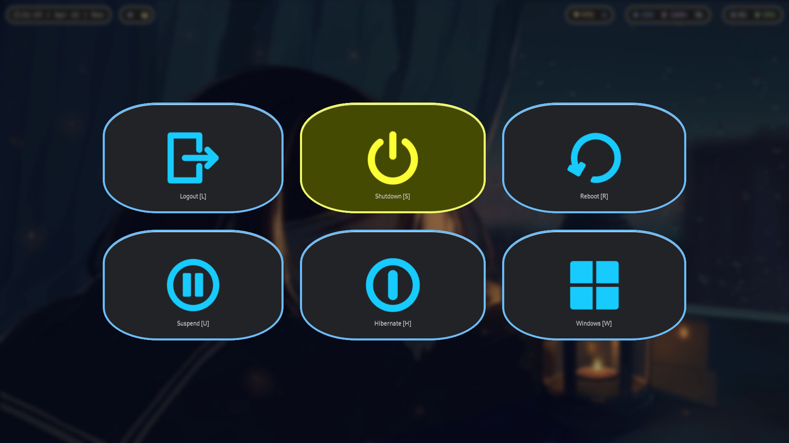

# 🌳 WLOGOUT (Logout Menu)

wlogout is a Wayland-native logout menu designed for Wayland compositors. It
provides a simple yet effective way to logout, restart, or shut down your
system from within a Wayland session.

| Keymap  | Description       |
| ------- | ----------------- |
| SUPER+b | Open wlogout Menu |
| l       | Logout            |
| u       | Suspend           |
| s       | Shutdown          |
| h       | Hibernate         |
| r       | Reboot            |
| w       | Reboot to Windows |
