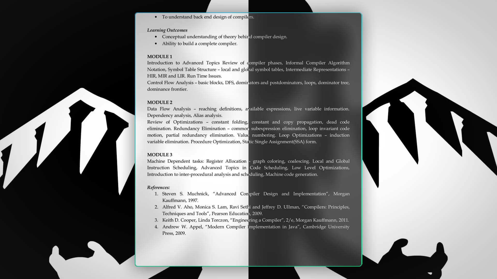

# 📄 POPPLER + ZATHURA (PDF Viewer)

**Backend**: Poppler is a free library for rendering Portable Document Format (PDF) documents. It is commonly used by the PDF viewers of the open source GNOME and KDE desktop environments. 

**Frontend**: Zathura is a free, plugin-based document viewer. Plugins are available for PDF (via poppler or MuPDF), PostScript and DjVu. It was written to be lightweight.

## PDF Viewer Keybindings

| Keymap | Description               |
| ------ | ------------------------- |
| b      | Booklet View Mode         |
| i      | Toggle Dark Mode          |
| f      | Toggle Fullscreen Mode    |
| j      | Scroll Down               |
| k      | Scroll Up                 |
| d      | Half Page Scroll Down     |
| u      | Half Page Scroll Up       |
| h      | Navigate to Previous Page |
| l      | Navigate to Next Page     |
| 0      | Set Default Zoom          |
| +      | Zoom In                   |
| -      | Zoom Out                  |
| x      | Close/Quit                |

## Features

- Darkmode for PDF by Default
- Smooth Scrolling
- Vim like half page jumping
