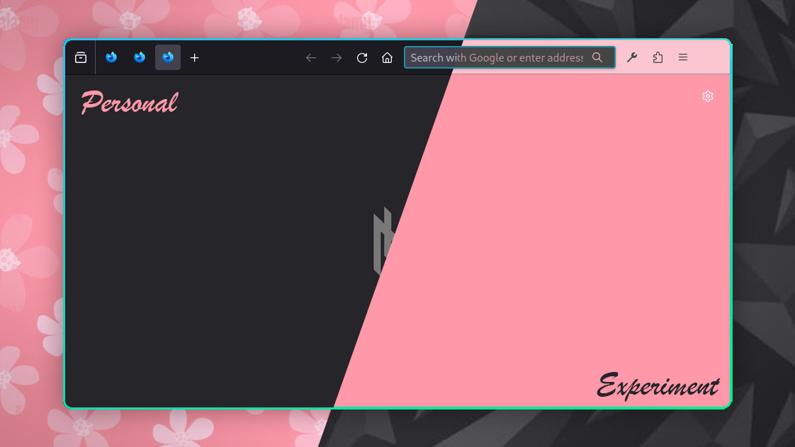

# 🦊 Firefox (Web Browser)

Because... monopoly have never been a good thing to be honest (except for the company ofc).

And this seems to be the least broken browser out there in the market.

## Problems

- ~Cannot use ESC to deselect url bar. [Bug Report](https://bugzilla.mozilla.org/show_bug.cgi?id=1086524) opened 10 years ago but still not solved.~
  > Happy news for Vimmers, this got fixed in 2024... on it's 10th anniversary 🎉
- `.mozilla` in $HOME, not following Freedesktop XDG Base Directory Specification
- Features and Open Issues stays on for Milleniums
- Even though customizable, it has many design limitations
- Tougher to implement vertical tabs natively

## Features:

- Icon only tabs - That's the only information I need though. How many tabs there are.
- Distinctive theming for different profiles to reflect the type of usage.
- Used oneBar as base because... "Dig out the best stuff and improve upon it"
- Hardened with Betterfox as it provides better performance and security without breaking anything. Arkenfox is a bit too aggressive.

## Setup

### Settings

- Download `user.js` from Betterfox into the profile directories.
  > This will enable css customizations by default.
- Open the Firefox Settings page:
  - Home > Firefox Home Content > Uncheck "Web Search" and "Shortcuts"
- On top right panel, rightclick Extensions icon > Customize Toolbar > Drag and remove all the unnecessary toolbar icons.

### Extensions

- Install everything manually in one `PROFILE`.
- To get the same extensions on other profiles, copy `~/.mozilla/firefox/{ PROFILE }/extensions` into other profile directories.

Personally I use these extensions:

#### Personal Profile

- Default Dark theme by Firefox
- uBlock Origin - Have never been a fan of ads
- Vimium C - Full on vimming on browser. Better contrast in tags and better usage than competitions.
- Dark Reader - Welcome to the dark side for every websites.
- Markdown Viewer, Asciidoctor js live preview - for live docs preview.

#### Experiment Profile

- pastel pink + charcoal by brad
- TWP Translate Web Pages by Filipe Dev - Translate any web page with just `Ctrl`+`Alt`+`T`.
- Theater Mode for YouTube™ by James Fray - Force YouTube to open in its player in the theater mode.
- BigTube by Pregnantboy - Better YouTube theatre mode. Full-sized theater mode, miniplayer on scroll, Popout player for all video sites.
- Return YouTube Dislike by Dmitry Selivanov - Say no to censorship of any kind. Hiding only specific information away from one is also a kind of lie.
- SponsorBlock by Ajay - Block those pesky in video promotions too. Don't let anyone persuade your interests.
- Clickbait Remover for Youtube by Pieter van Heijningen - No more getting your attention grabbed by those fake brainrot thumbnails.
