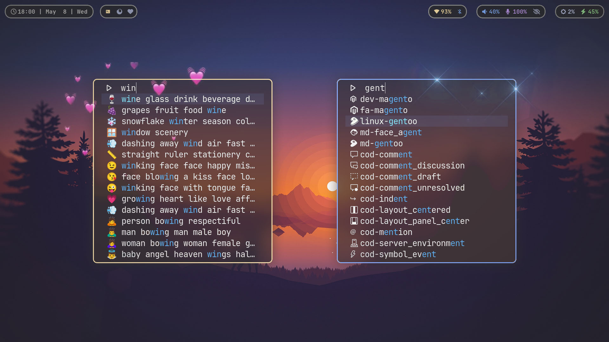
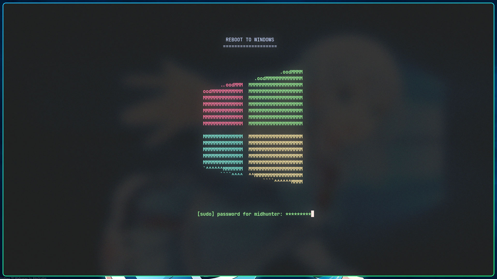

# 📜 Scripts

## Fetch Script (fetch.sh)

This script outputs information such as the operating system, host details,
package count, current date and time, uptime, and device specifications with
speed and efficiency.

## Emoji/NerdFont Menu (menu_emoji.sh, menu_nerdfont.sh)

Fuzzy matchable emojis using Fuzzel. Select entry `nerd font` in Emoji list to
load up Nerd Font list.

## Reboot Directly to W\*ndows (reboot_to_windows.sh)

Script which sets default selected GRUB entry temporarily to windows and
reboots.

## Script Descriptions

| Script               | Description                                        |
| -------------------- | -------------------------------------------------- |
| ai_brightness.sh     | Automatically set brightness based on your history |
| ai_idle.sh           | Automatically execute commands after timeout       |
| ai_theme.sh          | Wallpaper based auto transparency and more         |
| fetch.sh             | Simple Fetch Script                                |
| kill_hypr.sh         | Kill Hyprland Safely                               |
| menu_emoji.sh        | Emoji Selector                                     |
| menu_nerdfont.sh     | Nerdfont Selector                                  |
| menu_update.sh       | Emoji Update Script                                |
| menu_wifi.sh         | Wifi Selector                                      |
| reboot_to_windows.sh | Reboots directly to Windows                        |
| set_brightness.sh    | Brightness preference learner using brillo         |
| set_volume.sh        | Sets Systemwide Volume using pamixer               |
