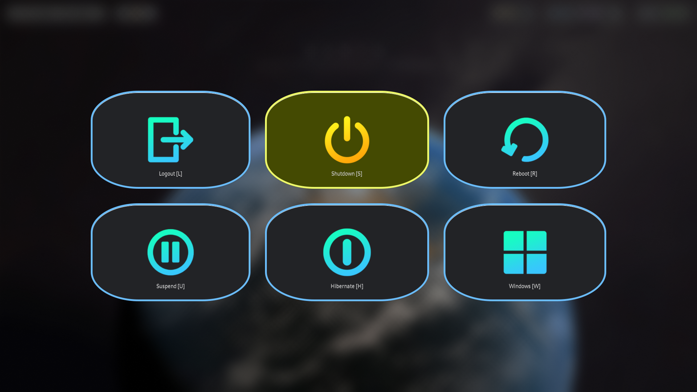

= Hunter OS

== 🌿 Philosophy

*Distro Agnostic*: Compatibility with a any linux based system for persisting
workflow regardless of preferred base.

*Terminal Focused*: The terminal is the heart of this distro, providing
CLI/TUI tools and utilities for efficient workflow tailored to personal
preference. Do 95% of work in TTY in the absence of a display server.

*Lightweight, Optimized, and Battery Efficient*: Perfectly engineered to be
light on system resources, ensuring smooth performance. Every aspect is
optimized for maximum efficiency, extending battery life and also have many
features at disposal.

*Keyboard Centric Workflow with Vim Style Keybindings*: Keyboard-centric
approach, with Vim-style keybindings deeply integrated into every tools, apps
and utilities. This allows to navigate and interact with speed, precision and
comfortability without even thinking about keybindings.

== 💼 Custom Configurations

[%header,cols=3*]
|===
| Name | Description | Thumbnail

| link:.config/cava/[📊 Cava]
| Music Visualizer
| image:.config/cava/.assets/cava.jpg[,128,link=.config/cava/]

| link:.config/feh/[🌄 Feh]
| Image Viewer
| image:.config/feh/.assets/feh.jpg[,128,link=.config/feh/]

| link:.mozilla/[🦊 FireFox]
| Web Browser
| image:.mozilla/assets/firefox.jpg[,128,link=.mozilla/]

| link:.config/fish/[🐟 Fish]
| Shell
| image:.config/fish/.assets/fish_lscd.jpg[,128,link=.config/fish/]

| link:.config/fuzzel/[📜 Fuzzel]
| App Launcher
| image:.config/fuzzel/.assets/fuzzel.jpg[,128,link=.config/fuzzel/]

| link:.config/hypr/[💧 Hyprland]
| Wayland Compositor
| 

| link:.config/keyd/[🎹 KeyD]
| Key Remapping Daemon
|

| link:.config/kitty/[🐱 Kitty]
| Terminal Emulator
| image:.config/kitty/.assets/kitty_nvim.jpg[,128,link=.config/kitty/]

| link:.config/lazygit/[😴 LazyGit]
| TUI Git Frontend
| image:.config/lazygit/.assets/lazygit.jpg[,128,link=.config/lazygit/]

| link:.config/mpv/[🎬 Mpv]
| Video Player
| image:.config/mpv/.assets/mpv.jpg[,128,link=.config/mpv/]

| link:https://github.com/MidHunterX/HunterX-PDE[📝 NeoVim]
| TUI Code Editor
| image:https://github.com/MidHunterX/NvME/blob/37a9ab0ee56159f744e670831e315ca085a7b218/img/nvim_dashboard.jpg[,128,link=https://github.com/MidHunterX/HunterX-PDE]

| link:Mid_Hunter/scripts/[⚙️ Scripts]
| Scripts
| image:Mid_Hunter/scripts/.assets/script_fetch.jpg[,128,link=Mid_Hunter/scripts/]

| link:.config/starship/[🚀 Starship]
| Shell Prompt Engine
| image:.config/starship/.assets/prompt.png[,128,link=.config/starship/]

| link:.config/tmux/[🍱 Tmux]
| Terminal Multiplexer
| image:.config/tmux/.assets/tmux.jpg[,128,link=.config/tmux/]

| link:.config/vifm/[📁 ViFM]
| File Manager
| image:.config/vifm/.assets/vifm.jpg[,128,link=.config/vifm/]

| link:.config/Code%20-%20OSS/User/[🆚 VSCode]
| GUI Code Editor
| image:.config/Code%20-%20OSS/User/.assets/code.jpg[,128,link=.config/Code%20-%20OSS/User/]

| link:.config/waybar/[🍫 WayBar]
| Status Bar
| image:.config/waybar/.assets/waybar.png[,128,link=.config/waybar/]

| link:.config/wlogout/[🌳 Wlogout]
| Logout Menu
| 

| link:.config/zathura/[📄 Zathura]
| PDF Frontend
| image:.config/zathura/.assets/zathura.jpg[,128,link=.config/zathura/]
|===

== 📦 Prefered Packages

.👢 Boot
[%collapsible]
====
[discrete]
=== 👢 Boot
[%header]
|===
| Package Name | Description
| dosfstools   | DOS Filesystem Utilities
| efibootmgr   | Utility to modify the EFI Boot Manager
| grub         | GNU GRand Unified Bootloader
| ntfs-3g      | NTFS filesystem driver and utilities
| os-prober    | Utility to detect other OSes on a set of drives
|===
====

.💾 Hardware
[%collapsible]
====
[discrete]
=== 💾 Hardware
[%header]
|===
| Package Name | Description
| acpi         | Client for battery, power and thermal readings
| acpi_call    | Kernel module to enable calls to ACPI (/proc/acpi/call)
| acpid        | Daemon for ACPI power management events
| amd-ucode    | Microcode update image for AMD CPUs
| amdvlk       | AMD's standalone Vulkan driver
| mesa-utils   | Essential Utilities for Open-source OpenGL drivers
|===
====

.⚙️ Utilities
[%collapsible]
====
[discrete]
=== ⚙️ Utilities
[%header]
|===
| Package Name      | Description                           | Src
| sudo              | Run commands as root                  | pacman
| bat               | cat with syntax highlighting          | pacman
| dust              | Disk space usage analyzer             | pacman
| exiv2             | Image EXIF Manipulation Tool          | pacman
| fd                | Faster alternative to find command    | pacman
| ffmpegthumbnailer | Video Thumbnailer                     | pacman
| fzf               | Fuzzy Finder Utility                  | pacman
| highlight         | Syntax Highlighter                    | pacman
| jq                | CLI JSON Processor                    | pacman
| libqalculate      | CLI NLP Calculator                    | pacman
| lsd               | ls with Nerd Font support             | pacman
| poppler           | PDF Rendering Engine                  | pacman
| ripgrep           | Text Search Tool                      | pacman
| speech-dispatcher | Speech Synthesis (spd-say)            | pacman
| xsv               | CLI CSV Processor                     | pacman
| brillo            | Brightness based on human perception  | aur
| cava              | Cross Platform Audio Visualizer       | aur
| tgpt              | CLI AI Chat without API keys          | aur
| warpd-git         | Modal Keyboard Driven Virtual Pointer | aur
|===
====

.📷 Audio, Video and Image
[%collapsible]
====
[discrete]
=== 📢 Audio
[%header]
|===
| Package Name   | Description                                     | Src
| pamixer        | CLI Volume Control Tool                         | pacman
| pavucontrol    | GUI Volume Control Tool                         | pacman
| pipewire       | Audio and Video streaming server                | pacman
| pipewire-pulse | A/V router & processor - PulseAudio replacement | pacman
| wireplumber    | PipeWire session/policy manager - wpctl         | pacman
|===

[discrete]
=== 🎬 Video
[%header]
|===
| Package Name | Description                                        | Src
| ffmpeg       | Super advanced library for handling Audio / Video  | pacman
| handbrake    | GUI Video Transcoder                               | pacman
| mpv          | Video Player - Minimal and integrates well with WM | pacman
| yt-dlp       | Video Downloader                                   | pacman
|===

[discrete]
=== 🌄 Image
[%header]
|===
| Package Name | Description                          | Src
| feh          | Image Viewer - Super light weight    | pacman
| nomacs       | Image Viewer - Touch screen friendly | aur
|===
====

.🌐 Network and Security
[%collapsible]
====
[discrete]
=== 🌐 Network and Security
[%header]
|===
| Package Name              | Description                        | Src
| android-file-transfer     | Mount Android Device               | pacman
| blueman                   | GUI Bluetooth Manager              | pacman
| bluez                     | Bluetooth Protocol Daemon          | pacman
| bluez-utils               | Bluetooth Utilities - bluetoothctl | pacman
| curlftpfs                 | Mount FTP as File System           | pacman
| dhcpcd                    | DHCP Client Daemon                 | pacman
| firefox-developer-edition | Internet Browser                   | pacman
| keepassxc                 | Password Manager                   | pacman
| networkmanager            | CLI Network Manager - nmcli, nmtui | pacman
| openssh                   | SSH protocol implementation        | pacman
| torbrowser-launcher       | Anonnymous Onion Browser           | pacman
| transmission-gtk          | GUI Torrent Client                 | pacman
| wpa_supplicant            | WLAN Daemon                        | pacman
|===
====

.📦 Development
[%collapsible]
====
[discrete]
=== 📦 Development
[%header]
|===
| Package Name  | Description                  | Src
| git           | Version control system       | pacman
| lazygit       | TUI for Git                  | pacman
| nodejs        | Node Java Script Runtime Env | pacman
| python        | Python Interpreter           | pacman
| sqlitebrowser | DB Browser for SQLite        | pacman
|===
====

.🌲 Desktop
[%collapsible]
====
[discrete]
=== 🌲 Desktop
[%header]
|===
| Package Name | Description                  | Src
| dunst        | Notification Daemon          | pacman
| fuzzel       | Wayland App Launcher         | pacman
| hyprland     | Wayland compositor           | pacman
| swayidle     | Wayland Idle Manager         | pacman
| waybar       | Wayland Status Bar           | pacman
| wl-clipboard | Wayland Clipboard Utility    | pacman
| wtype        | Wayland Keystrokes Emulation | pacman
| keyd         | Key Remapping Daemon         | aur
| swww         | Wayland Wallpaper Daemon     | aur
| wlogout      | Logout Screen                | aur
|===
====

.💻 2-in-1 Laptop Specific
[%collapsible]
====
[discrete]
=== 💻 2-in-1 Laptop Specific
[%header]
|===
| Package Name             | Description                            | Src
| iio-sensor-proxy         | Accelerometer Sensor Driver            | pacman
| tlp                      | Laptop Power Optimization              | pacman
| auto-cpufreq             | Dynamic CPU Clock Cycle Frequency      | aur
| detect-tablet-mode-git   | Tablet mode scripts - watch_tablet     | aur
| iio-hyprland-git         | Set Hyprland Orientation automatically | aur
| yoga-usage-mode-dkms-git | ACPI driver for Tablet mode detection  | aur
|===
====

.📄 Document viewers and editors
[%collapsible]
====
[discrete]
=== 📄 Document viewers and editors
[%header]
|===
| Package Name        | Description                 | Src
| neovim              | Text Editor                 | pacman
| code                | Open Source build of VSCode | pacman
| obsidian            | MarkDown Note taker         | pacman
| pdfarranger         | PDF Page Arranger           | pacman
| xournalpp           | PDF Annotation / Drawing    | pacman
| zathura             | PDF Graphical Viewer        | pacman
| zathura-pdf-poppler | Zathura Poppler Backend     | pacman
|===
====

.📁 Archivers and File Manager
[%collapsible]
====
[discrete]
=== 📁 Archivers and File Manager
[%header]
|===
| Package Name | Description          | Src
| fuse-zip     | FUSE mount zip files | pacman
| nemo         | GUI File Manager     | pacman
| p7zip        | CLI 7 Zip Archiver   | pacman
| unzip        | Unzip .zip archives  | pacman
| vifm         | TUI File Manager     | pacman
|===
====

.📊 System Monitors and Managers
[%collapsible]
====
[discrete]
=== 📊 System Monitors and Managers
[%header]
|===
| Package Name | Description           | Src
| nvtop        | GPU process monitor   | pacman
| powertop     | Battery usage monitor | pacman
| htim         | CPU process monitor   | aur
|===
====

.🖥️ Terminal
[%collapsible]
====
[discrete]
=== 🖥️ Terminal
[%header]
|===
| Package Name | Description                        | Src
| fish         | Modern Shell used as a Commandline | pacman
| kitty        | best of all terminals out there    | pacman
| starship     | Cross Platform Prompt              | pacman
| tmux         | Terminal Multiplexer               | pacman
|===
====

.🖋️ Fonts
[%collapsible]
====
[discrete]
=== 🖋️ Fonts
[%header]
|===
| Package Name            | Description                     | Src
| fontconfig              | Font Configuration              | pacman
| noto-fonts              | Google Font for Unicode Support | pacman
| noto-fonts-cjk          | Google Font for Unicode Support | pacman
| noto-fonts-emoji        | Google Font for Unicode Support | pacman
| ttf-jetbrains-mono-nerd | Nerd Font Icons patch           | pacman
|===
====

.🥃 Screenshot
[%collapsible]
====
[discrete]
=== 🥃 Screenshot
[%header]
|===
| Package Name       | Description                    | Src
| grim               | Screenshot Utility for Wayland | pacman
| slurp              | Region Selector for Wayland    | pacman
| tesseract          | OCR Utility                    | pacman
| tesseract-data-eng | Tesseract OCR Data English     | pacman
| tesseract-data-mal | Tesseract OCR Data Malayalam   | pacman
|===
====

== 🍇 Dependency Graph

This graph shows common dependencies among packages, highlighting those that
are utilized by multiple packages within the system. It provides a clear
visualization of the relationships between packages which can be useful when
changing into an alternative in the future without breaking the system.

[source,mermaid]
----
graph LR
vifm(📁 <a href='https://github.com/MidHunterX/Hunter-OS/tree/master/.config/vifm'>VIFM</a>)
ls{{lsd}}
cat{{bat}}
exif{{exiv2}}
syntax{{highlight}}
nvim(📝 <a href='https://github.com/MidHunterX/HunterX-PDE'>NeoVim</a>)
kitty(🐱 <a href='https://github.com/MidHunterX/Hunter-OS/tree/master/.config/kitty/'>Kitty</a>)
fish(🐟 <a href='https://github.com/MidHunterX/Hunter-OS/tree/master/.config/fish/'>Fish Shell</a>)
vos(🔈 VOS)
volume{{pamixer}}
brs(🔆 BRS)
brillo{{brillo}}
waybar(🍫 <a href='https://github.com/MidHunterX/Hunter-OS/tree/master/.config/waybar/'>Waybar</a>)
nf(Nerd Font)

vifm --> ls
vifm --> nvim
vifm --> nf
vifm --> exif
vifm --> syntax
fish --> ls
ls --> nf
fish --> vifm
fish --> vos
fish --> brs
fish --> cat
nvim --> vifm
nvim --> nf
kitty --> nvim
kitty --> fish
waybar --> volume
waybar --> brillo
waybar --> nf
vos --> volume
brs --> brillo
----

== 💽 System Configs

=== Sudoers
[source,bash]
----
sudoedit /etc/sudoers
----
./etc/sudoers
[source,bash]
----
# Sudo Stuff
Defaults timestamp_type=global      # Activate Sudo across terminals
Defaults timestamp_timeout = 10     # Activate Sudo for 10 minutes
Defaults passwd_timeout = 5         # Sudo prompt timeout after 5 minutes
# Login Stuff
Defaults insults                    # Incorrect Password Easteregg
Defaults pwfeedback                 # Visible Password Feedback
----

=== Skip Username
[source,bash]
----
sudo mkdir -p /etc/systemd/system/getty@tty1.service.d/
sudo touch /etc/systemd/system/getty@tty1.service.d/skip-username.conf
sudoedit /etc/systemd/system/getty@tty1.service.d/skip-username.conf
----
./etc/systemd/system/getty@tty1.service.d/skip-username.conf
[source,bash]
----
[Service]
ExecStart=
ExecStart=-/sbin/agetty -o '-p -- <username>' --noclear --skip-login - $TERM
----
