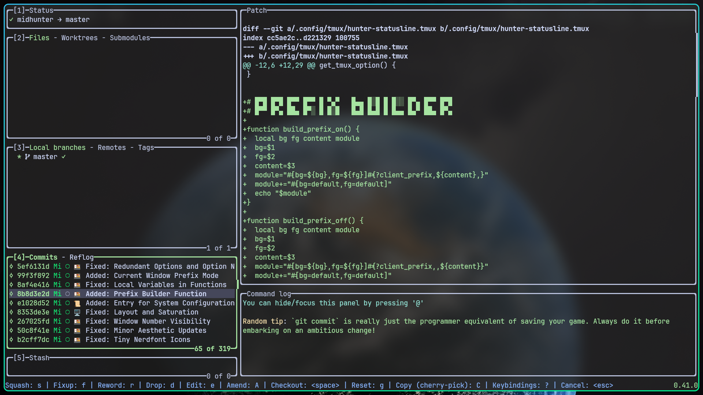

= Hunter OS

// ============================= [ VARIABLES ] ============================= //

// Repository Links
:gh-user: https://github.com/MidHunterX
:gh-repo: {gh-user}/Hunter-OS
:gh-repo-master: {gh-repo}/tree/master
:gh-nvim: {gh-user}/NvME
:gh-intention: {gh-user}/Intention
:gh-expression: {gh-user}/Expression
:gh-run: {gh-user}/Project-Launcher

// GitHub specific tags
ifdef::env-github[]
:tip-caption: :bulb:
:note-caption: :information_source:
:important-caption: :heavy_exclamation_mark:
:caution-caption: :fire:
:warning-caption: :warning:
endif::[]

// NOTE:
// * Use subs=attributes+ to enable attributes inside codeblock.

// ========================================================================= //

== 📜 Philosophy

*Terminal Centric and Reliable*: The terminal is the heart of this environment,
providing CLI/TUI tools and utilities for efficient workflow tailored to
personal preference. Even if the Display Server (central point of failure)
fails, navigate comfortably in TTY interface without feeling homesick.

*Optimized, and Battery Efficient*: Perfectly engineered to use the most
optimal amount of system resources, ensuring smooth performance while not
sacrificing on the amount of features and ability.

*Cohesive Universal Interface with Vim Keybindings*: Keyboard-centric approach,
with standardized Vim-style keybindings deeply integrated into every tools,
apps and utilities. This allows to navigate and interact with speed, precision
and comfort without even thinking about keybindings.

== 💼 Carefully Concocted Custom Configurations

Click the links below for a detailed documentation.

[%header,cols=3*]
|===
| Name | Description | Preview

| link:.config/keyd/[🎹 KeyD]
| Keyboard Layout/Mapping
|

| link:.config/vifm/[📁 ViFM]
| File Manager
| image:.config/vifm/.assets/vifm.jpg[,128,link=.config/vifm/]

| link:{gh-nvim}[📝 NeoVim]
| TUI Code Editor
| image:{gh-nvim}/blob/37a9ab0ee56159f744e670831e315ca085a7b218/img/nvim_dashboard.jpg[,128,link={gh-nvim}]

| link:.mozilla/[🦊 FireFox]
| Web Browser
| image:.mozilla/assets/firefox.jpg[,128,link=.mozilla/]

| link:.config/fish/[🐟 Fish]
| Shell
| image:.config/fish/.assets/fish_lscd.jpg[,128,link=.config/fish/]

| link:.config/tmux/[🍱 Tmux]
| Terminal Multiplexer
| image:.config/tmux/.assets/tmux.jpg[,128,link=.config/tmux/]

| link:.config/zathura/[📄 Zathura]
| PDF Frontend
| image:.config/zathura/.assets/zathura.jpg[,128,link=.config/zathura/]

| link:.config/cava/[📊 Cava]
| Music Visualizer
| image:.config/cava/.assets/cava.jpg[,128,link=.config/cava/]

| link:.config/feh/[🌄 Feh]
| Image Viewer
| image:.config/feh/.assets/feh.jpg[,128,link=.config/feh/]

| link:.config/fuzzel/[📜 Fuzzel]
| App Launcher
| image:.config/fuzzel/.assets/fuzzel.jpg[,128,link=.config/fuzzel/]

| link:.config/hypr/[💧 Hyprland]
| Wayland Compositor
| image:.config/hypr/.assets/hypr.jpg[,128,link=.config/hypr/]

| link:.config/kitty/[🐱 Kitty]
| Terminal Emulator
| image:.config/kitty/.assets/kitty_nvim.jpg[,128,link=.config/kitty/]

| link:.config/lazygit/[😴 LazyGit]
| TUI Git Frontend
| 

| link:.config/mpv/[🎬 Mpv]
| Video Player
| image:.config/mpv/.assets/mpv.jpg[,128,link=.config/mpv/]

| link:Mid_Hunter/scripts/[⚙️ Scripts]
| Scripts
| image:Mid_Hunter/scripts/.assets/script_fetch.jpg[,128,link=Mid_Hunter/scripts/]

| link:.config/starship/[🚀 Starship]
| Shell Prompt Engine
| image:.config/starship/.assets/prompt.png[,128,link=.config/starship/]

| link:.config/waybar/[🍫 WayBar]
| Status Bar
| image:.config/waybar/.assets/waybar.png[,128,link=.config/waybar/]

| link:.config/wlogout/[🌳 Wlogout]
| Logout Menu
| image:.config/wlogout/.assets/wlogout.jpg[,128,link=.config/wlogout/]
|===

== 🍇 Directed Diagram Denoting Documented Dependencies

|===
| 🔴 | Required Dependency
| 🟡 | Optional Dependency
|===

[source,mermaid,subs=attributes+]
----
flowchart LR

subgraph Orchestration Layer
  hypr(<a href='{gh-repo-master}/.config/hypr'>Hyprland</a>)
  run(<a href='{gh-run}'>Project Launcher</a>)
  expression(<a href='{gh-expression}'>Expression</a>)
  kitty(<a href='{gh-repo-master}/.config/kitty/'>Kitty</a>)
end

swww{{🔴 swww}}
vifm(<a href='{gh-repo-master}/.config/vifm'>ViFM</a>)
ls{{🟡 lsd / ls}}
cat{{🟡 bat / cat}}
find{{🟡 fd / find}}
grep{{🟡 ripgrep / grep}}
exif{{🟡 exiv2}}
tmux{{🟡 tmux}}
syntax{{🟡 highlight}}
nvim(<a href='{gh-nvim}'>NeoVim</a>)
fish(<a href='{gh-repo-master}/.config/fish/'>Fish Shell</a>)
cd{{🟡 zoxide / cd}}
volume{{🔴 pamixer}}
brillo{{🔴 brillo}}
waybar(<a href='{gh-repo-master}/.config/waybar/'>Waybar</a>)
nf(Nerd Font)
fzf{{🔴 fzf}}
git{{🟡 git / lazygit}}
prompt(<a href='{gh-repo-master}/.config/starship/'>Starship Prompt</a>)

hypr --> kitty
hypr --startup--> expression --> swww --wayland--> hypr
hypr --startup--> swww & waybar
hypr --textinput--> nvim
waybar --submap--> hypr
run --> tmux & nvim

kitty --scrollback pager--> nvim
kitty --default shell--> fish
fish --> ls & vifm & cd & git & cat & find & prompt
cd --> ls --> nf
prompt & fish --$VIFM_MODE--> vifm
fish --$editor--> nvim
vifm --> ls & nf
vifm --exif data--> exif
vifm --syntax highlighting--> syntax
vifm --file search--> fzf & find
nvim --vifm.vim--> vifm
vifm --$editor--> nvim
nvim --> nf & find & git & grep
nvim --graphics_protocol--> kitty
waybar --> volume & brillo & nf
----

.🎨 Dynamic UI Coloring
[%collapsible]
====
[discrete]
=== 🎨 Dynamic UI Coloring

`matugen` is used to generate dynamic Material You colors for applications.

IMPORTANT: Color generators like matugen are so pervasive, it becomes a dependency for app config colors unless there's a way to set fallback colors on app configs. This makes the configs non-plug-n-play for other systems until all variables are replaced with hex colorcodes. The main focus of this section is to make every configs independent and plug-n-play friendly again.

|===
| 🟢 | matugen Optional (Plug n Play Friendly)
| 🔴 | matugen Required
|===

[source,mermaid,subs=attributes+]
----
graph TD
expression(<a href='{gh-expression}'>Expression</a>)
vifm(<a href='{gh-repo-master}/.config/vifm'>ViFM</a>)

%% ========================== Sourcing Techniques ========================== %%

conditional_sourcing{{Conditional Sourcing}}
override_sourcing{{Override Sourcing}}
default_fallback{{Fallback Defaults}}
ansi{{<a href='{gh-repo-master}/.config/matugen/templates/kitty.conf'>ANSI Convention</a>}}
settings{{UI Settings}}

%% ======================== Implementation Progress ======================== %%

expression & vifm --> ai[iris.pl]
ai --> gen[matugen] & hypr[🟢 hyprland]
gen --> hypr --colors/2_colors.conf--> override_sourcing
gen --> notif[🟢 dunst] --dunstrc.d/99-colors.conf--> override_sourcing
gen --> term[🟢 kitty] --colors/colors.conf--> override_sourcing
gen --> tmux[🟢 tmux] --colors.conf--> conditional_sourcing
gen --> vifm[🟢 vifm] --colors/colors.vifm--> conditional_sourcing
gen --> nvim[🟢 nvim] --colors/colors.lua--> conditional_sourcing
gen --> app[🟢 fuzzel] --themes/colors.ini--> default_fallback
gen --> top[🟢 btop] --themes/colors.theme--> settings
gen --> app2[🟢 vicinae] --(Plugins UI)--> settings
gen --> power[🔴 wlogout]
gen --> bar[🔴 waybar]
gen --> vis[🔴 cava]

ansi --> term
git[🟢 lazygit] --> ansi
fish[🟢 fish] --> ansi
prompt[🟢 starship] --> ansi

%% ========================================================================= %%
----

[discrete]
==== Techniques Used

- **Override Sourcing**: Sourcing the generated file which replaces the pre-existing color variables. Programs which allow to source non-existing files without errors or uses a special directory to source files can do this. This is the most preferred solution as all it takes is just one source command in config.
- **Conditional Sourcing**: Conditionally source the generated file if it exists. Programs which has well designed DSLs with file operations or has embedded language can do this. This is second most preferred way as changing the DSL syntax can break things and it'll be time consuming if there are many different configs like this.
- **Default Fallback**: The program have in-built fallback configs which can be used if the generated file doesn't exist.
- **ANSI Convention**: Using specific 16 color ANSI codes to represent semantic colors. This should only be used as a last resort if all other methods fail. Most likely TUI apps which doesn't provide robust way of configuring colors and especially it uses a simplistic config like yaml or have no config at all but uses 16 colors.
- **UI Settings**: This is the least preferred method and it's a terrible design. Should use in-built UI to set the dynamic theme because the config files are used as a cache instead like btop.

[discrete]
==== Notes

- Waybar & Wlogout: There's no way to conditionally source/implement fallback in GTK-CSS. Only way is to copy a generated file initially.
- cava: No option for theme fallback in config as it is doing an in-built parsing. The least resistant path would be to generate config file directly from matugen.

Both solutions are non-plug-n-play friendly on their own unless you provide copy of a pre-generated file before running. Therefore use custom made status bar, logout screen etc. with a GUI shell framework like Astal with AGS or QuickShell.
====

.🌊 Integrated System Interaction Architecture
[%collapsible]
====
[discrete]
=== 🌊 Integrated System Interaction Architecture

[source,mermaid,subs=attributes+]
----
graph LR

%% ============= Cross Operating System Context Relay Protocol ============= %%
subgraph XOSCRP
  intention(<a href='{gh-intention}'>Intention</a>)
  linux(Linux)
  windows(Windows)
  grub{<a href='{gh-repo}?tab=readme-ov-file#-grub-bootloader'>GRUB</a>}
  keyd{{<a href='{gh-repo-master}/.config/keyd/'>KeyD</a>}}
end

intention --> grub --> linux & windows
linux -.SEND.-> intention -.RECV.-> linux & windows

%% ============================= Core Workflow ============================= %%
nvim(<a href='{gh-nvim}'>NeoVim</a>)
fish(<a href='{gh-repo-master}/.config/fish/'>Fish Shell</a>)
vifm(<a href='{gh-repo-master}/.config/vifm'>ViFM</a>)
kitty(<a href='{gh-repo-master}/.config/kitty/'>Kitty</a>)
hypr(<a href='{gh-repo-master}/.config/hypr'>Hyprland</a>)
firefox(<a href='{gh-repo-master}/.mozilla/'>Firefox</a>)

keyd --- linux ==Bash Shell==> hypr

subgraph Development Area
	tmux(<a href='{gh-repo-master}/.config/tmux/'>TMUX</a>)
	run(<a href='{gh-run}'>Project Launcher</a>)
	git(<a href='{gh-repo-master}/.config/lazygit/'>Lazygit</a>)
end

fish ==Edit Command (alt+e)==> nvim
nvim ==Nested Terminal (alt+/)==> fish
vifm ==Edit Files (i/l)==> nvim
nvim ==Open Files (leader pf)==> vifm
vifm ==cd Temporarily (s)==> fish
fish ==(vm/vc)==> vifm

hypr_exec{{Execute Mode}}
hypr --(Meta+e)--> hypr_exec

hypr_exec --(k)--> kitty
hypr_exec --Nvim TextInput (n)--> nvim
kitty --Scrollback History(alt+n)--> nvim

%% ========================== Development Workflow ========================== %%
fish --(run)--- run --> tmux --> nvim & fish
git --Edit Commit (ctrl+o e)--> nvim
nvim --Git UI (leader gc)-->git

%% ============================= Jump Workflow ============================= %%
cursor{{Cursor Target}}

hypr_cur{{Cursor Mode}}
hypr -.Cursor Mode (Meta+c).-> hypr_cur
hypr_cur <-.Pixel Jump (f).-> cursor

hypr_col{{ColorPicker Mode}}
hypr_cur -.(c).-> hypr_col
hypr_col -.Select Pixel Color (i).-> cursor
hypr_col -.go back (esc).-> hypr_cur

nvim -.Immediate Jump (f).-> cursor
nvim -.Local Jump (s).-> cursor
nvim -.Global Jump (leader sf).-> cursor
firefox -.Element Focus (f).-> cursor
firefox -.TextInput Focus (gi).-> cursor

%% ======================== Entertainment Workflow ======================== %%
hypr_exec --(f)--> firefox
firefox --Global Video (ctrl+shift+})--> hypr
----
====

== 📦 Preeminently Preferred Primary Packages

Click the following categories to toggle the list of packages in that category.

.🐧 Linux System
[%collapsible]
====
[discrete]
=== 🐧 Linux System
[%header]
|===
| Package Name   | Description                                     | Src
| base           | Base Arch Installation                          | pacman
| base-devel     | Basic tools to build Arch Linux packages        | pacman
| linux          | The Linux kernel and modules                    | pacman
| linux-firmware | Firmware files for Linux                        | pacman
| linux-headers  | Headers and scripts for building modules        | pacman
| pacman-contrib | Scripts and tools for pacman systems (paccache) | pacman
|===

[discrete]
==== Yay - Yet Another Yogurt AUR Helper
[source,bash]
----
git clone https://aur.archlinux.org/yay-bin.git
cd yay-bin
makepkg -si
----
====

.👢 Boot
[%collapsible]
====
[discrete]
=== 👢 Boot
[%header]
|===
| Package Name    | Description                             | Src
| dosfstools      | DOS Filesystem Utilities                | pacman
| efibootmgr      | Utility to modify the EFI Boot Manager  | pacman
| grub            | GNU GRand Unified Bootloader            | pacman
| ntfs-3g         | NTFS filesystem driver and utilities    | pacman
| os-prober       | Utility to detect other OSes            | pacman
| plymouth        | Graphical boot splash screen            | pacman
| cantarell-fonts | Humanist sans serif font (for plymouth) | pacman
|===
====

.💾 Hardware
[%collapsible]
====
[discrete]
=== 💾 Hardware
[%header]
|===
| Package Name | Description                                    | Src
| acpi         | Client for battery, power and thermal readings | pacman
| acpi_call    | Kernel module call ACPI (/proc/acpi/call)      | pacman
| acpid        | Daemon for ACPI power management events        | pacman
| amd-ucode    | Microcode update image for AMD CPUs            | pacman
| amdvlk       | AMD's standalone Vulkan driver                 | pacman
| mesa-utils   | Essential Utilities for Open-source OpenGL     | pacman
|===
====

.📦 Development
[%collapsible]
====
[discrete]
=== 📦 Development
[%header]
|===
| Package Name  | Description                  | Src
| git           | Version control system       | pacman
| lazygit       | TUI for Git                  | pacman
| git-delta     | Git Syntax Highlighted Pager | pacman
| meson         | Nice build system            | pacman
| nodejs        | JavaScript Runtime Env       | pacman
| npm           | NodeJS package manager       | pacman
| python        | Python Interpreter           | pacman
| sqlitebrowser | DB Browser for SQLite        | pacman
| jdk-openjdk   | Java Development Kit         | pacman
|===

NOTE: Before installing jdk-openjdk, make sure to yeet out the pre-installed java package.
====

.⚙️ Utilities
[%collapsible]
====
[discrete]
=== ⚙️ Utilities
[%header]
|===
| Package Name      | Description                           | Src
| sudo              | Run commands as root                  | pacman
| bat               | cat with syntax highlighting          | pacman
| zoxide            | Better alternative to cd command      | pacman
| dust              | Disk usage analyzer (static)          | pacman
| ncdu              | Disk space cleaner (interactive)      | pacman
| exiv2             | Image EXIF Manipulation Tool          | pacman
| fd                | Faster alternative to find command    | pacman
| ffmpegthumbnailer | Video Thumbnailer                     | pacman
| fzf               | Fuzzy Finder Utility                  | pacman
| highlight         | Syntax Highlighter                    | pacman
| jq                | CLI JSON Processor                    | pacman
| libqalculate      | CLI NLP Calculator                    | pacman
| lsd               | ls with Nerd Font support             | pacman
| man-db            | Utility for reading man pages         | pacman
| poppler           | PDF Rendering Engine                  | pacman
| ripgrep           | Text Search Tool                      | pacman
| xsv               | CLI CSV Processor                     | pacman
| fastfetch         | Fetch System Information              | pacman
| localsend-bin     | Air-drop like Local File Transfer     | aur
| onefetch          | Fetch Git Project Information         | aur
| brillo            | Brightness based on human perception  | aur
| tgpt              | CLI AI Chat without API keys          | aur
| wl-kbptr          | Cursor Modal Keyboard Driven Pointer  | aur
| wlrctl            | Cursor Control Utility                | aur
|===
====

.📷 Audio, Video and Image
[%collapsible]
====
[discrete]
=== 📢 Audio
[%header]
|===
| Package Name    | Description                                     | Src
| pamixer         | CLI Volume Control Tool                         | pacman
| pavucontrol     | GUI Volume Control Tool                         | pacman
| pipewire        | Audio and Video streaming server                | pacman
| pipewire-pulse  | A/V router & processor - PulseAudio replacement | pacman
| wireplumber     | PipeWire session/policy manager - wpctl         | pacman
| easyeffects     | Loudness Equalization                           | pacman
| lsp-plugins-lv2 | easyeffects: equalizer, compressor, loudness    | pacman
| calf            | easyeffects: limiter, exciter, bass enhancer    | pacman
| cava            | Cross Platform Audio Visualizer                 | aur
|===

[discrete]
=== 🎬 Video
[%header]
|===
| Package Name | Description                                        | Src
| ffmpeg       | Super advanced library for handling Audio / Video  | pacman
| handbrake    | GUI Video Transcoder                               | pacman
| mpv          | Video Player - Minimal and integrates well with WM | pacman
| yt-dlp       | Video Downloader                                   | pacman
|===

[discrete]
=== 🌄 Image
[%header]
|===
| Package Name | Description                          | Src
| feh          | Image Viewer - Super light weight    | pacman
| nomacs       | Image Viewer - Touch screen friendly | aur
|===
====

.🌐 Network and Security
[%collapsible]
====
[discrete]
=== 🌐 Network and Security
[%header]
|===
| Package Name              | Description                        | Src
| android-file-transfer     | Mount Android Device               | pacman
| blueman                   | GUI Bluetooth Manager              | pacman
| bluez                     | Bluetooth Protocol Daemon          | pacman
| bluez-utils               | Bluetooth Utilities - bluetoothctl | pacman
| curlftpfs                 | FUSE mount ftp sites               | pacman
| termscp                   | TUI client for SCP, FTP, Kube, S3  | pacman
| dhcpcd                    | DHCP Client Daemon                 | pacman
| firefox                   | Internet Browser                   | pacman
| keepassxc                 | Password Manager                   | pacman
| networkmanager            | CLI Network Manager - nmcli, nmtui | pacman
| openssh                   | SSH protocol implementation        | pacman
| torbrowser-launcher       | Anonnymous Onion Browser           | pacman
| transmission-gtk          | GUI Torrent Client                 | pacman
| wpa_supplicant            | WLAN Daemon                        | pacman
| speedometer               | TUI Network Speed Monitor          | aur
|===

[discrete]
==== FUSE Mounted FTP File Transfer Issue
When using `curlftpfs` to FUSE mount and copy files over FTP, there's a common issue with not being able to copy over file names/paths containing spaces because of how the FTP protocol and the FUSE layer handle escaping (files should be URL-encoded). As a workaround you can:
* Just rename the file before copying
* Use `termscp` but you'll have to use their TUI interface instead of direct filesystem access.

====

.🌲 Desktop
[%collapsible]
====
[discrete]
=== 🌲 Desktop
[%header]
|===
| Package Name                | Description                  | Src
| libnotify                   | Notification library         | pacman
| matugen                     | Material You Color Generator | pacman
| dunst                       | Notification Daemon          | pacman
| fuzzel                      | Wayland App Launcher         | pacman
| hyprland                    | Wayland compositor           | pacman
| hyprpicker                  | Hypr Color Picker            | pacman
| xdg-desktop-portal-hyprland | Hypr Desktop Portal          | pacman
| swayidle                    | Wayland Idle Manager         | pacman
| swayosd                     | On Screen Display Window     | pacman
| waybar                      | Wayland Status Bar           | pacman
| wl-clipboard                | wl-copy + wl-paste           | pacman
| wtype                       | Wayland Keystrokes Emulation | pacman
| vicinae-bin                 | Raycast Launcher alt         | aur
| wf-recorder                 | Wayland Screen Recorder      | aur
| keyd                        | Key Remapping Daemon         | aur
| swww                        | Wayland Wallpaper Daemon     | aur
| wlogout                     | Logout Screen                | aur
|===
NOTE: wl-screenrec might be optimized, fast, efficient and Lightweight but it doesn't work in battery saver mode unlike wf-recorder.

WARNING: xdg-desktop-portal-hyprland enables features like screen sharing. There is a bug when the display is rotated, screen sharing shows it as default landscape mode. This is because `SPA_META_VideoTransform` is not present in the buffer metadata for **PipeWire streams**. This is what many apps, including browsers use to determine if and how the captured image needs to be rotated and Browser WebRTC doesn't support the SPA_META_VideoTransform metadata as well. This issue can be tracked here: https://github.com/hyprwm/xdg-desktop-portal-hyprland/issues/292[issue 292] and in WebRTC: https://issues.webrtc.org/issues/42226058[issue 42226058]. Have to wait (most likely a decade or two) until WebRTC fixes it.

====

.💻 2-in-1 Laptop Specific
[%collapsible]
====
[discrete]
=== 💻 2-in-1 Laptop Specific
[%header]
|===
| Package Name             | Description                            | Src
| iio-sensor-proxy         | Accelerometer Sensor Driver            | pacman
| tlp                      | Laptop Power Optimization              | pacman
| auto-cpufreq             | Dynamic CPU Clock Cycle Frequency      | aur
| detect-tablet-mode-git   | Tablet mode scripts - watch_tablet     | aur
| iio-hyprland-git         | Set Hyprland Orientation automatically | aur
| yoga-usage-mode-dkms-git | ACPI driver for Tablet mode detection  | aur
|===
====

.📄 Document viewers and editors
[%collapsible]
====
[discrete]
=== 📄 Document viewers and editors
[%header]
|===
| Package Name        | Description                 | Src
| neovim              | Text Editor                 | pacman
| obsidian            | MarkDown Note taker         | pacman
| pdfarranger         | PDF Page Arranger           | pacman
| xournalpp           | PDF Annotation / Drawing    | pacman
| zathura             | PDF Graphical Viewer        | pacman
| zathura-pdf-poppler | Zathura Poppler Backend     | pacman
|===
====

.📁 Archivers and File Manager
[%collapsible]
====
[discrete]
=== 📁 Archivers and File Manager
[%header]
|===
| Package Name | Description          | Src
| fuse-zip     | FUSE mount zip files | pacman
| nemo         | GUI File Manager     | pacman
| p7zip        | CLI 7 Zip Archiver   | pacman
| unzip        | Unzip .zip archives  | pacman
| vifm         | TUI File Manager     | pacman
| docx2txt     | View .docx files     | pacman
| odt2txt      | View .odt files      | pacman
| rar2fs       | FUSE mount rar files | aur
|===
====

.📊 System Monitors and Managers
[%collapsible]
====
[discrete]
=== 📊 System Monitors and Managers
[%header]
|===
| Package Name | Description           | Src
| nvtop        | GPU process monitor   | pacman
| powertop     | Battery usage monitor | pacman
| htim         | CPU process monitor   | aur
|===
====

.🖥️ Terminal
[%collapsible]
====
[discrete]
=== 🖥️ Terminal
[%header]
|===
| Package Name | Description                        | Src
| fish         | Modern Shell used as a Commandline | pacman
| kitty        | best of all terminals out there    | pacman
| starship     | Cross Platform Prompt              | pacman
| tmux         | Terminal Multiplexer               | pacman
|===
====

.🖋️ Fonts
[%collapsible]
====
[discrete]
=== 🖋️ Fonts
[%header]
|===
| Package Name            | Description                     | Src
| fontconfig              | Font Configuration              | pacman
| noto-fonts              | Google Font for Unicode Support | pacman
| noto-fonts-cjk          | Google Font for Unicode Support | pacman
| ttf-jetbrains-mono-nerd | Nerd Font Icons patch           | pacman
|===

[discrete]
=== 😀 Emojis
With no emoji fonts installed, all of the emojis should look like boxes.
Install any one of the following to use systemwide:

[%header]
|===
| Package Name     | Description         | Src
| noto-fonts-emoji | Emoji by Google     | pacman
| ttf-joypixels    | High quality emojis | pacman
| ttf-twemoji      | Emoji by Twitter    | yay
|===

* noto-fonts-emoji emojis are easily distinguishable from each other when font size is small; like on terminals. Uses COLRv1.
* ttf-twemoji is perfect for bigger font size. Perfect for Web Browsers.
* ttf-joypixels has that premium feel. Search it up.

My Recommendation: Install `ttf-joypixels` and `noto-fonts-emoji`

* On every GUI apps, high quality ttf-joypixels is used.
* On Kitty terminal, it will fallback to using noto-fonts-emoji.

.To make ttf-twemoji take precedence over noto-fonts-emoji on GUI:
[source,bash]
----
sudo ln -s /usr/share/fontconfig/conf.avail/75-twemoji.conf /etc/fonts/conf.d/
----
====

.🥃 Screenshot
[%collapsible]
====
[discrete]
=== 🥃 Screenshot
[%header]
|===
| Package Name       | Description                    | Src
| grim               | Screenshot Utility for Wayland | pacman
| slurp              | Region Selector for Wayland    | pacman
| tesseract          | OCR Utility                    | pacman
| tesseract-data-eng | Tesseract OCR Data English     | pacman
|===
====

== 🛎️ Sustained System Services

[%header]
|===
| Service Name           | Description
| dhcpcd.service         | DHCP/ IPv4LL/ IPv6RA/ DHCPv6 client
| NetworkManager.service | Network connection manager

| {gh-repo-master}/.config/keyd/[keyd.service]
| A key remapping daemon for linux

| swayosd-libinput-backend.service
| Libinput daemon for sway OSD server
|===

.Enable services at startup with:
[source,bash]
----
systemctl enable <Service_Name>
----

== 💽 Core Computational Configurations

=== 👢 GRUB Bootloader
image:.config/GRUB/.assets/cyberexs.jpg[]
[source,bash]
----
sudo cp -R ~/.config/GRUB/CyberEXS /boot/grub/themes
sudoedit /etc/default/grub
sudo grub-mkconfig -o /boot/grub/grub.cfg
----
.📝 /etc/default/grub [add]
[source,bash]
----
GRUB_THEME=/boot/grub/themes/CyberEXS/theme.txt
----
.📝 /etc/default/grub [replace]
[source,bash]
----
GRUB_TIMEOUT=1
# Setting "splash" for boot splash screen with plymouth
GRUB_CMDLINE_LINUX_DEFAULT="loglevel=3 quiet splash"
# Read other EFI with os-prober
GRUB_DISABLE_OS_PROBER=false
----

=== 🫟 Plymouth Splash Screen
image:./.config/PLYMOUTH/.assets/cuts_alt.gif[]
[source,bash]
----
sudo cp -R ~/.config/PLYMOUTH/cuts_alt /usr/share/plymouth/themes
sudo plymouth-set-default-theme -R cuts_alt
----

NOTE: The splash screen included here is one from the 80+ plymouth splash screens from https://github.com/adi1090x/plymouth-themes[adi1090x/plymouth-themes].

=== 👥 Usergroups

List all available groups that you can assign:
[source,bash]
----
cat /etc/group
----

[source,bash]
----
sudo usermod -G wheel,audio,video,power,input,storage midhunter
----
[%header]
|===
| Group   | Purpose
| wheel   | Grants sudo privileges
| audio   | Access to audio devices
| video   | Access to GPU and hardware acceleration.
| power   | Control power states (suspend, reboot, etc.)
| input   | Access to input devices
| storage | Raw access to storage devices
|===

Verify currently active groups:
[source,bash]
----
groups midhunter
----

=== 🎹 KeyD Setup
[source,bash]
----
sudo ln -s ~/.config/keyd/default.conf /etc/keyd/default.conf
systemctl enable keyd.service
systemctl start keyd.service
----

=== 🔑 Sudoers
[source,bash]
----
sudoedit /etc/sudoers
----
.📝 /etc/sudoers [add]
[source,bash]
----
# Sudo Stuff
# Defaults timestamp_type=global      # Activate Sudo across terminals (not recommended)
Defaults timestamp_timeout = 10     # Activate Sudo for 10 minutes
Defaults passwd_timeout = 5         # Sudo prompt timeout after 5 minutes
# Login Stuff
Defaults insults                    # Incorrect Password Easteregg
Defaults pwfeedback                 # Visible Password Feedback
----

=== 🚪 Skip Username
[source,bash]
----
sudo mkdir -p /etc/systemd/system/getty@tty1.service.d/
sudo touch /etc/systemd/system/getty@tty1.service.d/skip-username.conf
sudoedit /etc/systemd/system/getty@tty1.service.d/skip-username.conf
----
.📝 /etc/systemd/system/getty@tty1.service.d/skip-username.conf [add]
[source,bash]
----
[Service]
ExecStart=
ExecStart=-/sbin/agetty -o '-p -- midhunter' --noclear --skip-login - $TERM
----

or use this line if you want to **auto login** to a specific user on TTY1

.📝 /etc/systemd/system/getty@tty1.service.d/skip-username.conf [add]
[source,bash]
----
[Service]
ExecStart=
ExecStart=-/sbin/agetty --noissue --autologin 'midhunter' - $TERM
----

=== 🍬 Colorful Pacman
[source,bash]
----
sudoedit /etc/pacman.conf
----
.📝 /etc/pacman.conf [add]
[source,bash]
----
ParallelDownloads = 5
Color
ILoveCandy
----

=== 🚫 Rage against the Censorship

*dhcpcd* brings up the networking interface (wlp2s0/eth0), assigns IP and other host configurations.

*NetworkManager* gives tools like nmcli and nmtui to connect to WiFi and manage network related tasks more easily.

Both *dhcpcd* and *NetworkManager* have the ability to configure DNS nameservers from your *ISP* in `/etc/resolv.conf`.
Since we are going to use our own custom DNS config, we need to tell them both to stop auto-generating DNS configurations.

Tell dhcpcd:

[source,bash]
----
sudoedit /etc/dhcpcd.conf
sudo systemctl restart dhcpcd
----

.📝 /etc/dhcpcd.conf [append]
[source,bash]
----
nohook resolv.conf
----

Tell NetworkManager:

[source,bash]
----
sudoedit /etc/NetworkManager/conf.d/dns.conf
sudo systemctl restart NetworkManager
----

.📝 /etc/NetworkManager/conf.d/dns.conf
[source,bash]
----
[main]
dns=none
----

Now, set all the DNS nameservers you want to use instead.

[source,bash]
----
sudoedit /etc/resolv.conf
----

.📝 /etc/resolv.conf
[source,bash]
----
# Custom static DNS configuration
nameserver 1.1.1.1     # Cloudflare
nameserver 1.0.0.1     # Cloudflare secondary
nameserver 8.8.8.8     # Google
nameserver 8.8.4.4     # Google secondary
----

NOTE: systemd-resolved can also set DNS config but since we are not enabling that service, it will not do anything.

== ⚗️ Empathic Environment Engineering Experiment

Exploring reduction of Cognitive Load by Intent based context switching, Calm
technology inspired ambient nudging, Automation and Proactive Computing.

[discrete]
.Core Philosophies
- Computers and tools should understand context, intent and work for humans.
- Environment should support cognitive flow, not disrupt or redirect it.
- Interactions should be reproducible and logically consistent to create a mental model that will be transferred to human muscle memory so that the interface disappears over time and only intent exists.

link:{gh-run}[Run]: Automating project initialization and environment setup.
Helps to maintain cognitive context of task without distracting yourself from
manual setup.

link:{gh-expression}[Expression]: Expressing a non-intrusive ambient
notification of life events and schedules. Know time schedule without knowing
the time. Useful for humans with low interoception who works on computers all
day.

link:{gh-intention}[Intention]: An implementation of Proactive computing where
you simply state your intent and let your computer change and modify its
environment to adapt to your intention. Abstracts away Operating Systems to use
it as specialized environment for a specific intent.

link:automata/idle[Auto Idle]: The device will shutdown itself when it's left
unattended for a long time at sleeping hours but if it's working hours, the
device will suspend instead to save power.

link:automata/iris.pl[Adaptive Window Contrast]: An adaptive
interface design solution for UI contrast issues with transparent windows. It
makes the window text readable against both light and dark wallpapers by
detecting the brightness of the Wallpaper and adjusting the perceived
transparency of the window (via blur brightness + contrast).

.`Fig: Window brightness (perceived) adapted to 60% across wallpapers with varying brightness`
image:Mid_Hunter/scripts/.assets/auto_adaptation.jpg[link=automata/iris.pl]

= Personal Notes

== 🗒️ Partition Proportions
[%header]
|===
| Partition   | Recommended Size | Max Used
| /           | > 50G            | 45G
| /boot       | = 256M           | 230M
| /tmp (swap) | = 4G             | 200M
| /home       | > 128G           | 40G
|===

=== Dynamic Resizing

Use BTRFS to create a single logical volume and make the partitions into
logical sub-volumes. No more unmounting, no fsck, no live USB to resize
partitions.

== 🤫 SSH

Create separate SSH keys for separate stuff.

[source,bash]
----
ssh-keygen -t ed25519 -f ~/.ssh/id_ed25519          # Personal Key
ssh-keygen -t ed25519 -f ~/.ssh/id_ed25519_company  # Work Key
----

=== Work-Life Separation (Multiple GitHub Accounts)

.📝 $HOME/.ssh/config
[source,config]
----
Host github.com
  IdentityFile ~/.ssh/id_ed25519
  IdentitiesOnly yes

Host github-company
  IdentityFile ~/.ssh/id_ed25519_company
  IdentitiesOnly yes
----

.📝 $HOME/.gitconfig-company
[source,config]
----
[url "git@github-company:"]
  insteadOf = git@github.com:
  insteadOf = https://github.com/
----

.📝 $HOME/.gitconfig
[source,config]
----
[includeIf "gitdir:~/projects/work/"]
  path = ~/.gitconfig-company
----

- `~/projects/personal/` → personal account
- `~/projects/work/` → work account

Now you just clone normally. Git and SSH handle the rest. No more manual switching, no more mistakes.
