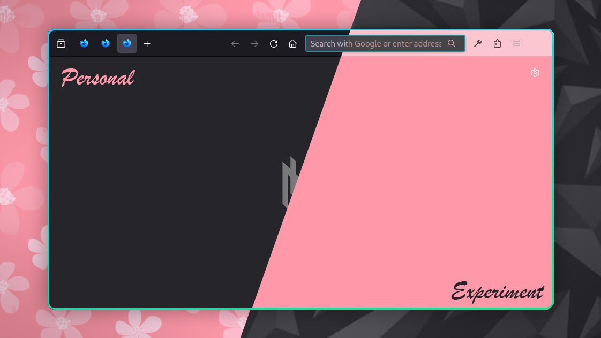
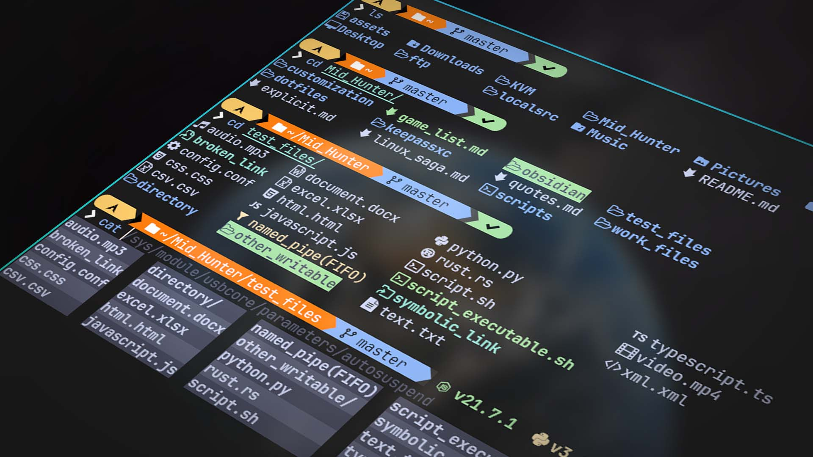
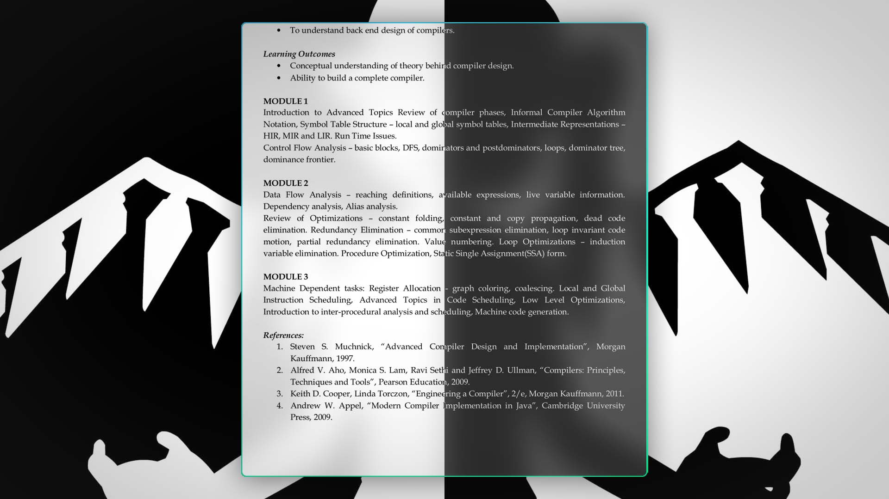

= Hunter OS

ifdef::env-github[]
:tip-caption: :bulb:
:note-caption: :information_source:
:important-caption: :heavy_exclamation_mark:
:caution-caption: :fire:
:warning-caption: :warning:
endif::[]

== 🌿 Philosophy

*Terminal Centric*: The terminal is the heart of this environment, providing
CLI/TUI tools and utilities for efficient workflow tailored to personal
preference.

*Lightweight, Optimized, and Battery Efficient*: Perfectly engineered to be
light on system resources, ensuring smooth performance. Every aspect is
optimized for maximum efficiency, extending battery life and also have many
features at disposal.

*Keyboard Centric Workflow with Vim Style Keybindings*: Keyboard-centric
approach, with Vim-style keybindings deeply integrated into every tools, apps
and utilities. This allows to navigate and interact with speed, precision and
comfortability without even thinking about keybindings.

== 💼 Contained Custom Concocted Configurations

Click the links below for a detailed documentation.

[%header,cols=3*]
|===
| Name | Description | Preview

| link:.config/keyd/[🎹 KeyD]
| Keyboard Layout/Mapping
|

| link:.config/cava/[📊 Cava]
| Music Visualizer
| image:.config/cava/.assets/cava.jpg[,128,link=.config/cava/]

| link:.config/feh/[🌄 Feh]
| Image Viewer
| image:.config/feh/.assets/feh.jpg[,128,link=.config/feh/]

| link:.mozilla/[🦊 FireFox]
| Web Browser
| 

| link:.config/fish/[🐟 Fish]
| Shell
| 

| link:.config/fuzzel/[📜 Fuzzel]
| App Launcher
| image:.config/fuzzel/.assets/fuzzel.jpg[,128,link=.config/fuzzel/]

| link:.config/hypr/[💧 Hyprland]
| Wayland Compositor
| image:.config/hypr/.assets/hypr.jpg[,128,link=.config/hypr/]

| link:.config/kitty/[🐱 Kitty]
| Terminal Emulator
| image:.config/kitty/.assets/kitty_nvim.jpg[,128,link=.config/kitty/]

| link:.config/lazygit/[😴 LazyGit]
| TUI Git Frontend
| image:.config/lazygit/.assets/lazygit.jpg[,128,link=.config/lazygit/]

| link:.config/mpv/[🎬 Mpv]
| Video Player
| image:.config/mpv/.assets/mpv.jpg[,128,link=.config/mpv/]

| link:https://github.com/MidHunterX/HunterX-PDE[📝 NeoVim]
| TUI Code Editor
| image:https://github.com/MidHunterX/NvME/blob/37a9ab0ee56159f744e670831e315ca085a7b218/img/nvim_dashboard.jpg[,128,link=https://github.com/MidHunterX/HunterX-PDE]

| link:Mid_Hunter/scripts/[⚙️ Scripts]
| Scripts
| image:Mid_Hunter/scripts/.assets/script_fetch.jpg[,128,link=Mid_Hunter/scripts/]

| link:.config/starship/[🚀 Starship]
| Shell Prompt Engine
| image:.config/starship/.assets/prompt.png[,128,link=.config/starship/]

| link:.config/tmux/[🍱 Tmux]
| Terminal Multiplexer
| image:.config/tmux/.assets/tmux.jpg[,128,link=.config/tmux/]

| link:.config/vifm/[📁 ViFM]
| File Manager
| image:.config/vifm/.assets/vifm.jpg[,128,link=.config/vifm/]

| link:.config/Code%20-%20OSS/User/[🆚 VSCode]
| GUI Code Editor
| image:.config/Code%20-%20OSS/User/.assets/code.jpg[,128,link=.config/Code%20-%20OSS/User/]

| link:.config/waybar/[🍫 WayBar]
| Status Bar
| image:.config/waybar/.assets/waybar.png[,128,link=.config/waybar/]

| link:.config/wlogout/[🌳 Wlogout]
| Logout Menu
| image:.config/wlogout/.assets/wlogout.jpg[,128,link=.config/wlogout/]

| link:.config/zathura/[📄 Zathura]
| PDF Frontend
| 
|===

== 📦 Preeminently Preferred Primary Packages

Click the following categories to toggle the list of packages in that category.

.🐧 Linux System
[%collapsible]
====
[discrete]
=== 🐧 Linux System
[%header]
|===
| Package Name   | Description                                     | Src
| base           | Base Arch Installation                          | pacman
| base-devel     | Basic tools to build Arch Linux packages        | pacman
| linux          | The Linux kernel and modules                    | pacman
| linux-firmware | Firmware files for Linux                        | pacman
| linux-headers  | Headers and scripts for building modules        | pacman
| pacman-contrib | Scripts and tools for pacman systems (paccache) | pacman
|===
====

.👢 Boot
[%collapsible]
====
[discrete]
=== 👢 Boot
[%header]
|===
| Package Name    | Description                             | Src
| dosfstools      | DOS Filesystem Utilities                | pacman
| efibootmgr      | Utility to modify the EFI Boot Manager  | pacman
| grub            | GNU GRand Unified Bootloader            | pacman
| ntfs-3g         | NTFS filesystem driver and utilities    | pacman
| os-prober       | Utility to detect other OSes            | pacman
| plymouth        | Graphical boot splash screen            | pacman
| cantarell-fonts | Humanist sans serif font (for plymouth) | pacman
|===
====

.💾 Hardware
[%collapsible]
====
[discrete]
=== 💾 Hardware
[%header]
|===
| Package Name | Description                                    | Src
| acpi         | Client for battery, power and thermal readings | pacman
| acpi_call    | Kernel module call ACPI (/proc/acpi/call)      | pacman
| acpid        | Daemon for ACPI power management events        | pacman
| amd-ucode    | Microcode update image for AMD CPUs            | pacman
| amdvlk       | AMD's standalone Vulkan driver                 | pacman
| mesa-utils   | Essential Utilities for Open-source OpenGL     | pacman
|===
====

.📦 Development
[%collapsible]
====
[discrete]
=== 📦 Development
[%header]
|===
| Package Name  | Description                  | Src
| git           | Version control system       | pacman
| lazygit       | TUI for Git                  | pacman
| git-delta     | Git Syntax Highlighted Pager | pacman
| meson         | Nice build system            | pacman
| nodejs        | Node Java Script Runtime Env | pacman
| npm           | Node JS package manager      | pacman
| python        | Python Interpreter           | pacman
| sqlitebrowser | DB Browser for SQLite        | pacman
|===
====

.⚙️ Utilities
[%collapsible]
====
[discrete]
=== ⚙️ Utilities
[%header]
|===
| Package Name      | Description                           | Src
| sudo              | Run commands as root                  | pacman
| bat               | cat with syntax highlighting          | pacman
| zoxide            | Better alternative to cd command      | pacman
| dust              | Disk usage analyzer (static)          | pacman
| ncdu              | Disk space cleaner (interactive)      | pacman
| exiv2             | Image EXIF Manipulation Tool          | pacman
| fd                | Faster alternative to find command    | pacman
| ffmpegthumbnailer | Video Thumbnailer                     | pacman
| fzf               | Fuzzy Finder Utility                  | pacman
| highlight         | Syntax Highlighter                    | pacman
| jq                | CLI JSON Processor                    | pacman
| libqalculate      | CLI NLP Calculator                    | pacman
| lsd               | ls with Nerd Font support             | pacman
| man-db            | Utility for reading man pages         | pacman
| poppler           | PDF Rendering Engine                  | pacman
| ripgrep           | Text Search Tool                      | pacman
| speech-dispatcher | Speech Synthesis (spd-say)            | pacman
| xsv               | CLI CSV Processor                     | pacman
| brillo            | Brightness based on human perception  | aur
| tgpt              | CLI AI Chat without API keys          | aur
| wl-kbptr          | Cursor Modal Keyboard Driven Pointer  | aur
| wlrctl            | Cursor Control Utility                | aur
|===
====

.📷 Audio, Video and Image
[%collapsible]
====
[discrete]
=== 📢 Audio
[%header]
|===
| Package Name    | Description                                     | Src
| pamixer         | CLI Volume Control Tool                         | pacman
| pavucontrol     | GUI Volume Control Tool                         | pacman
| pipewire        | Audio and Video streaming server                | pacman
| pipewire-pulse  | A/V router & processor - PulseAudio replacement | pacman
| wireplumber     | PipeWire session/policy manager - wpctl         | pacman
| easyeffects     | Loudness Equalization                           | pacman
| lsp-plugins-lv2 | easyeffects: equalizer, compressor, loudness    | pacman
| calf            | easyeffects: limiter, exciter, bass enhancer    | pacman
| cava            | Cross Platform Audio Visualizer                 | aur
|===

[discrete]
=== 🎬 Video
[%header]
|===
| Package Name | Description                                        | Src
| ffmpeg       | Super advanced library for handling Audio / Video  | pacman
| handbrake    | GUI Video Transcoder                               | pacman
| mpv          | Video Player - Minimal and integrates well with WM | pacman
| yt-dlp       | Video Downloader                                   | pacman
|===

[discrete]
=== 🌄 Image
[%header]
|===
| Package Name | Description                          | Src
| feh          | Image Viewer - Super light weight    | pacman
| nomacs       | Image Viewer - Touch screen friendly | aur
|===
====

.🌐 Network and Security
[%collapsible]
====
[discrete]
=== 🌐 Network and Security
[%header]
|===
| Package Name              | Description                        | Src
| android-file-transfer     | Mount Android Device               | pacman
| blueman                   | GUI Bluetooth Manager              | pacman
| bluez                     | Bluetooth Protocol Daemon          | pacman
| bluez-utils               | Bluetooth Utilities - bluetoothctl | pacman
| termscp                   | TUI client for SCP, FTP, Kube, S3  | pacman
| dhcpcd                    | DHCP Client Daemon                 | pacman
| firefox-developer-edition | Internet Browser                   | pacman
| keepassxc                 | Password Manager                   | pacman
| networkmanager            | CLI Network Manager - nmcli, nmtui | pacman
| openssh                   | SSH protocol implementation        | pacman
| torbrowser-launcher       | Anonnymous Onion Browser           | pacman
| transmission-gtk          | GUI Torrent Client                 | pacman
| wpa_supplicant            | WLAN Daemon                        | pacman
|===
====

.🌲 Desktop
[%collapsible]
====
[discrete]
=== 🌲 Desktop
[%header]
|===
| Package Name                | Description                  | Src
| libnotify                   | Notification library         | pacman
| dunst                       | Notification Daemon          | pacman
| fuzzel                      | Wayland App Launcher         | pacman
| hyprland                    | Wayland compositor           | pacman
| xdg-desktop-portal-hyprland | Desktop Integration Portal   | pacman
| swayidle                    | Wayland Idle Manager         | pacman
| waybar                      | Wayland Status Bar           | pacman
| wl-clipboard                | wl-copy + wl-paste           | pacman
| wtype                       | Wayland Keystrokes Emulation | pacman
| wf-recorder                 | Wayland Screen Recorder      | aur
| keyd                        | Key Remapping Daemon         | aur
| swww                        | Wayland Wallpaper Daemon     | aur
| wlogout                     | Logout Screen                | aur
|===
NOTE: wl-screenrec might be optimized, fast, efficient and Lightweight but it doesn't work in battery saver mode unlike wf-recorder.

WARNING: xdg-desktop-portal-hyprland enables features like screen sharing. There is a bug when the display is rotated, screen sharing shows it as default landscape mode. This is because `SPA_META_VideoTransform` is not present in the buffer metadata for **PipeWire streams**. This is what many apps, including browsers use to determine if and how the captured image needs to be rotated and Browser WebRTC doesn't support the SPA_META_VideoTransform metadata as well. This issue can be tracked here: https://github.com/hyprwm/xdg-desktop-portal-hyprland/issues/292[issue 292] and in WebRTC: https://issues.webrtc.org/issues/42226058[issue 42226058]. Have to wait until WebRTC fixes it.
====

.💻 2-in-1 Laptop Specific
[%collapsible]
====
[discrete]
=== 💻 2-in-1 Laptop Specific
[%header]
|===
| Package Name             | Description                            | Src
| iio-sensor-proxy         | Accelerometer Sensor Driver            | pacman
| tlp                      | Laptop Power Optimization              | pacman
| auto-cpufreq             | Dynamic CPU Clock Cycle Frequency      | aur
| detect-tablet-mode-git   | Tablet mode scripts - watch_tablet     | aur
| iio-hyprland-git         | Set Hyprland Orientation automatically | aur
| yoga-usage-mode-dkms-git | ACPI driver for Tablet mode detection  | aur
|===
====

.📄 Document viewers and editors
[%collapsible]
====
[discrete]
=== 📄 Document viewers and editors
[%header]
|===
| Package Name        | Description                 | Src
| neovim              | Text Editor                 | pacman
| code                | Open Source build of VSCode | pacman
| obsidian            | MarkDown Note taker         | pacman
| pdfarranger         | PDF Page Arranger           | pacman
| xournalpp           | PDF Annotation / Drawing    | pacman
| zathura             | PDF Graphical Viewer        | pacman
| zathura-pdf-poppler | Zathura Poppler Backend     | pacman
|===
====

.📁 Archivers and File Manager
[%collapsible]
====
[discrete]
=== 📁 Archivers and File Manager
[%header]
|===
| Package Name | Description          | Src
| fuse-zip     | FUSE mount zip files | pacman
| nemo         | GUI File Manager     | pacman
| p7zip        | CLI 7 Zip Archiver   | pacman
| unzip        | Unzip .zip archives  | pacman
| vifm         | TUI File Manager     | pacman
| docx2txt     | View .docx files     | pacman
| odt2txt      | View .odt files      | pacman
| curlftpfs    | FUSE mount ftp sites | pacman
|===
====

.📊 System Monitors and Managers
[%collapsible]
====
[discrete]
=== 📊 System Monitors and Managers
[%header]
|===
| Package Name | Description           | Src
| nvtop        | GPU process monitor   | pacman
| powertop     | Battery usage monitor | pacman
| htim         | CPU process monitor   | aur
|===
====

.🖥️ Terminal
[%collapsible]
====
[discrete]
=== 🖥️ Terminal
[%header]
|===
| Package Name | Description                        | Src
| fish         | Modern Shell used as a Commandline | pacman
| kitty        | best of all terminals out there    | pacman
| starship     | Cross Platform Prompt              | pacman
| tmux         | Terminal Multiplexer               | pacman
|===
====

.🖋️ Fonts
[%collapsible]
====
[discrete]
=== 🖋️ Fonts
[%header]
|===
| Package Name            | Description                     | Src
| fontconfig              | Font Configuration              | pacman
| noto-fonts              | Google Font for Unicode Support | pacman
| noto-fonts-cjk          | Google Font for Unicode Support | pacman
| ttf-jetbrains-mono-nerd | Nerd Font Icons patch           | pacman
|===

[discrete]
=== 😀 Emojis
With no emoji fonts installed, all of the emojis should look like boxes.
Install any one of the following to use systemwide:

[%header]
|===
| Package Name     | Description         | Src
| noto-fonts-emoji | Emoji by Google     | pacman
| ttf-joypixels    | High quality emojis | pacman
| ttf-twemoji      | Emoji by Twitter    | yay
|===

* noto-fonts-emoji emojis are easily distinguishable from each other when font size is small; like on terminals. Uses COLRv1.
* ttf-twemoji is perfect for bigger font size. Perfect for Web Browsers.
* ttf-joypixels has that premium feel. Search it up.

My Recommendation: Install `ttf-joypixels` and `noto-fonts-emoji`

* On every GUI apps, high quality ttf-joypixels is used.
* On Kitty terminal, it will fallback to using noto-fonts-emoji.

.To make ttf-twemoji take precedence over noto-fonts-emoji on GUI:
[source,bash]
----
sudo ln -s /usr/share/fontconfig/conf.avail/75-twemoji.conf /etc/fonts/conf.d/
----
====

.🥃 Screenshot
[%collapsible]
====
[discrete]
=== 🥃 Screenshot
[%header]
|===
| Package Name       | Description                    | Src
| grim               | Screenshot Utility for Wayland | pacman
| slurp              | Region Selector for Wayland    | pacman
| tesseract          | OCR Utility                    | pacman
| tesseract-data-eng | Tesseract OCR Data English     | pacman
| tesseract-data-mal | Tesseract OCR Data Malayalam   | pacman
|===
====

=== 🚙 Extra Utility Tools

==== Yay - Yet Another Yogurt AUR Helper
[source,bash]
----
sudo pacman -S --needed git base-devel
git clone https://aur.archlinux.org/yay-bin.git
cd yay-bin
makepkg -si
----

== 🍇 Directed Dependency Diagram

|===
| 🔴 | Required Dependency
| 🟡 | Optional Dependency
| 🟢 | Good to Have Dependency
|===

[source,mermaid]
----
graph LR
vifm(<a href='https://github.com/MidHunterX/Hunter-OS/tree/master/.config/vifm'>VIFM</a>)
ls{{🟡 lsd / ls}}
cat{{🟡 bat / cat}}
exif{{🟢 exiv2}}
syntax{{🔴 highlight}}
nvim(<a href='https://github.com/MidHunterX/HunterX-PDE'>NeoVim</a>)
kitty(<a href='https://github.com/MidHunterX/Hunter-OS/tree/master/.config/kitty/'>Kitty</a>)
fish(<a href='https://github.com/MidHunterX/Hunter-OS/tree/master/.config/fish/'>Fish Shell</a>)
vos(VOS)
cd{{🟡 zoxide / cd}}
volume{{🔴 pamixer}}
brs(BRS)
brillo{{🔴 brillo}}
waybar(<a href='https://github.com/MidHunterX/Hunter-OS/tree/master/.config/waybar/'>Waybar</a>)
nf(Nerd Font)

vifm --> ls
vifm --> nvim
vifm --> nf
vifm --> exif
vifm --> syntax
fish --> ls
ls --> nf
fish --> vifm
fish --> cd
fish --> vos
fish --> brs
fish --> cat
nvim --> vifm
nvim --> nf
kitty --> nvim
kitty --> fish
waybar --> volume
waybar --> brillo
waybar --> nf
vos --> volume
brs --> brillo
----

== 🛎️ System Services

[%header]
|===
| Service                | Description
| NetworkManager.service | Network connection manager
| dhcpcd.service         | DHCP/ IPv4LL/ IPv6RA/ DHCPv6 client
| https://github.com/MidHunterX/Hunter-OS/tree/master/.config/keyd/[keyd.service]
| A key remapping daemon for linux
|===

== 💽 System Configs

=== GRUB Bootloader
image:.config/GRUB/.assets/cyberexs.jpg[]
[source,bash]
----
sudo cp -R ~/.config/GRUB/CyberEXS /boot/grub/themes
sudoedit /etc/default/grub
sudo grub-mkconfig -o /boot/grub/grub.cfg
----
.📝 /etc/default/grub [add]
[source,bash]
----
GRUB_THEME=/boot/grub/themes/CyberEXS/theme.txt
----
.📝 /etc/default/grub [replace]
[source,bash]
----
GRUB_TIMEOUT=1
# Setting "splash" for boot splash screen with plymouth
GRUB_CMDLINE_LINUX_DEFAULT="loglevel=3 quiet splash"
# Read other EFI with os-prober
GRUB_DISABLE_OS_PROBER=false
----

=== Plymouth Splash Screen
image:./.config/PLYMOUTH/.assets/cuts_alt.gif[]
[source,bash]
----
sudo cp -R ~/.config/PLYMOUTH/cuts_alt /usr/share/plymouth/themes
sudo plymouth-set-default-theme -R cuts_alt
----

NOTE: The splash screen included here is one from the 80+ plymouth splash screens from https://github.com/adi1090x/plymouth-themes[adi1090x/plymouth-themes].

=== Usergroups

[source,bash]
----
sudo usermod -G wheel,audio,video,power,input,storage midhunter
----
[%header]
|===
| Group   | Purpose
| wheel   | Grants sudo privileges
| audio   | Access to audio devices
| video   | Access to GPU and hardware acceleration.
| power   | Control power states (suspend, reboot, etc.)
| input   | Access to input devices
| storage | Raw access to storage devices
|===

Verify currently active groups:
[source,bash]
----
groups midhunter
----

=== KeyD Setup
[source,bash]
----
sudo ln -s ~/.config/keyd/default.conf /etc/keyd/default.conf
systemctl enable keyd.service
systemctl start keyd.service
----

=== Sudoers
[source,bash]
----
sudoedit /etc/sudoers
----
.📝 /etc/sudoers [add]
[source,bash]
----
# Sudo Stuff
Defaults timestamp_type=global      # Activate Sudo across terminals
Defaults timestamp_timeout = 10     # Activate Sudo for 10 minutes
Defaults passwd_timeout = 5         # Sudo prompt timeout after 5 minutes
# Login Stuff
Defaults insults                    # Incorrect Password Easteregg
Defaults pwfeedback                 # Visible Password Feedback
----

=== Skip Username
[source,bash]
----
sudo mkdir -p /etc/systemd/system/getty@tty1.service.d/
sudo touch /etc/systemd/system/getty@tty1.service.d/skip-username.conf
sudoedit /etc/systemd/system/getty@tty1.service.d/skip-username.conf
----
.📝 /etc/systemd/system/getty@tty1.service.d/skip-username.conf [add]
[source,bash]
----
[Service]
ExecStart=
ExecStart=-/sbin/agetty -o '-p -- midhunter' --noclear --skip-login - $TERM
----

or use this line if you want to **auto login** to a specific user on TTY1

.📝 /etc/systemd/system/getty@tty1.service.d/skip-username.conf [add]
[source,bash]
----
[Service]
ExecStart=
ExecStart=-/sbin/agetty --noissue --autologin 'midhunter' - $TERM
----

=== Colorful Pacman
[source,bash]
----
sudoedit /etc/pacman.conf
----
.📝 /etc/pacman.conf [add]
[source,bash]
----
ParallelDownloads = 5
Color
ILoveCandy
----

== 🗒️ Personal Notes

=== Partition Sizes
[%header]
|===
| Partition   | Recommended Size | Max Used
| /           | ~ 32G            | 18G
| /boot       | = 256M           | 230M
| /tmp (swap) | = 4G             | 8K
| /home       | > 128G           | 40G
|===

