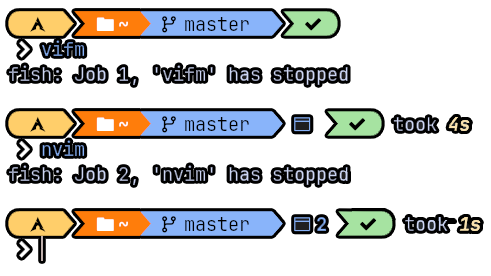
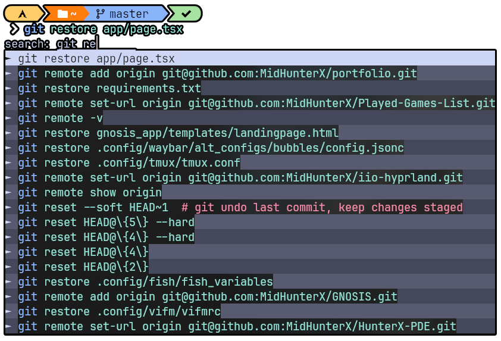
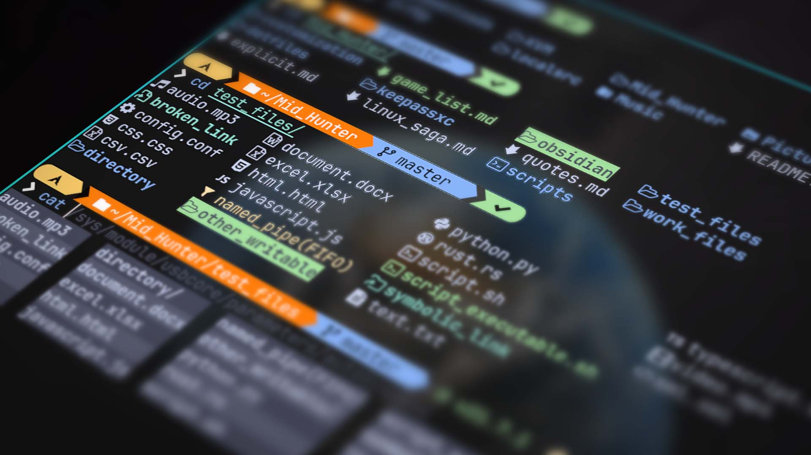
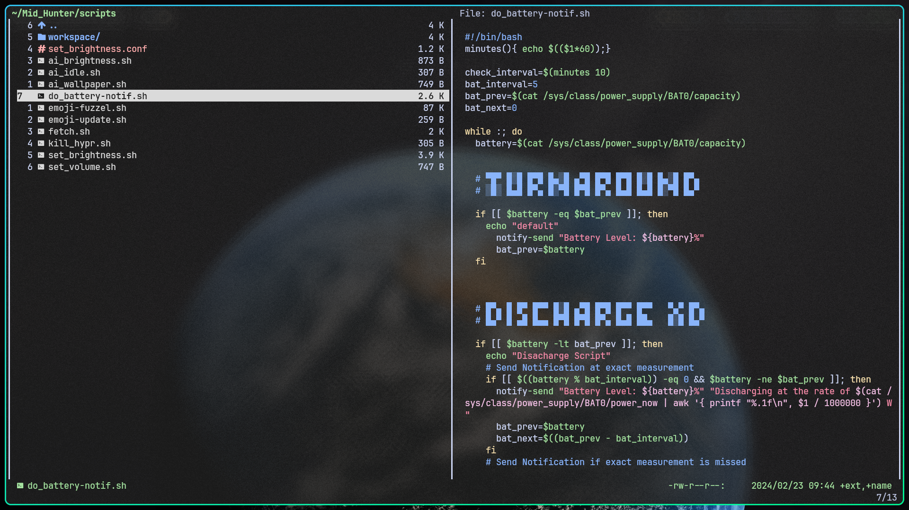

# Hunter OS

## 🌿 Philosophy

**Distro Agnostic**: Designed to be compatible with a wide range of Linux distributions, ensuring workflow features regardless of preferred base.

**Terminal Focused**: The terminal is the heart of this project, providing CLI/TUI tools and utilities for efficient and streamlined workflows.

**Lightweight, Optimized, and Battery Efficient**: Perfectly engineered to be light on system resources, ensuring smooth performance even on low-powered devices. Every aspect is optimized for maximum efficiency, extending battery life and also have many features at disposal.

**Keyboard Centric Workflow with Vim Style Keybindings**: Promotes a keyboard-centric approach, with Vim-style keybindings deeply integrated into every tools, apps and utilities. This allows to navigate and interact with speed, precision and comfortability.

**Focus on Flexibility**: Offers multiple pathways to accomplish tasks to choose the method that best suits the workflow at that specific moment in time.

## 🍫 Status Bar (waybar)

Highly customizable Wayland bar for Sway and Wlroots based compositors.

## 🌄 Image Viewer (feh)

feh is a lightweight image viewer aimed mainly at users of command line interfaces. Unlike most graphical image viewers, feh does not have any graphical control elements.

| Keymap      | Description             |
| ----------- | ----------------------- |
| u           | Zoom In                 |
| d           | Zoom Out                |
| s           | Set to Fit Zoom         |
| S           | Set to Default Zoom     |
| j, h, left  | Previous Image          |
| k, l, right | Next Image              |
| f           | Toggle Fullscreen       |
| o           | Toggle EXIF Information |
| i           | View Filename           |
| q, x        | Quit/Close              |

## 🐚 Shell (fish)

fish is a Unix shell with a focus on interactivity and usability. Fish is designed to give the user features by default, rather than by configuration. Fish is considered an exotic shell since it does not adhere to POSIX shell standards, at the discretion of the maintainers.

### Abbreviated Commands

| Command  | Description                                   |
| -------- | --------------------------------------------- |
| yeet     | Remove Packages along with their Dependencies |
| woman    | Yapping all possible Man pages                |
| sayonara | Shutdown Computer                             |
| brs      | Set Brightness                                |
| vos      | Set System Volume                             |
| cls      | Clear Terminal Screen (`CTRL + L`)            |

### Move Terminal Apps to BG and FG

- Press `CTRL + Z` when inside terminal app to move it to Background.
- Press `CTRL + Z` inside terminal prompt to move BG app to Foreground.

The number of background apps will be shown in prompt as shown.

### Auto Complete based on CMD History

- Go to Normal Mode and search using `/`

### Better LS and CD navigation

Navigate using ls and cd with much better comfortability.

- Install **lsd** and **bat** for the NerdFont goodness.

### Extra Functionalities

- `Alt + e` to edit shell prompt input inside Neovim
- Auto Pair brackets and quotes
- Clean out bad CMD History

## 🚀 Shell Prompt (starship)

Structure: `[ OS > ( Directory | Git Branch ) > Info > Status ]`

### Vim Modes

Insert Mode:

Normal Mode:

Visual Mode:

Replace Mode:

## 🎹 System Wide Key Remaps (keyd)

Linux lacks a good key remapping solution. In order to achieve satisfactory results a medley of tools need to be employed (e.g xcape, xmodmap) with the end result often being tethered to a specified environment (X11). keyd attempts to solve this problem by providing a flexible system wide daemon which remaps keys using kernel level input primitives (evdev, uinput).

| Remap            | Output Key             |
| ---------------- | ---------------------- |
| Space + h        | Left                   |
| Space + j        | Down                   |
| Space + k        | Up                     |
| Space + l        | Right                  |
| Space + w        | Move One Word Forward  |
| Space + b        | Move One Word Backward |
| f j              | Esc                    |
| CapsLock (Click) | Esc                    |
| CapsLock (Press) | Ctrl                   |

## 🐱 Terminal Emulator (kitty)

kitty is a free and open-source GPU-accelerated terminal emulator for Linux and macOS focused on performance and features. kitty is written in a mix of C and Python programming languages. It provides GPU support. kitty shares its name with another program — KiTTY — a fork of PuTTY for Microsoft Windows.

| Keymap                   | Description                    |
| ------------------------ | ------------------------------ |
| Alt + N                  | Send Terminal to Neovim Buffer |
| Ctrl + Shift + N         | New Tab                        |
| Ctrl + Shift + J         | Scroll Line Down               |
| Ctrl + Shift + K         | Scroll Line Up                 |
| Ctrl + Shift + D         | Scroll Page Down               |
| Ctrl + Shift + U         | Scroll Page Up                 |
| Ctrl + Shift + Backspace | Clear One Whole Word           |

## 🎬 Video Player (mpv)

mpv is free and open-source media player software based on MPlayer, mplayer2 and FFmpeg. It runs on several operating systems, including Unix-like operating systems (Linux, BSD-based, macOS) and Microsoft Windows. It is cross-platform, running on ARM, PowerPC, x86/IA-32, x86-64, and MIPS architecture.

| Keymap | Description             |
| ------ | ----------------------- |
| d      | Volume Down by 2        |
| u      | Volume Up by 2          |
| x      | Close                   |
| h      | Seek -10s               |
| l      | Seek +10s               |
| H      | Seek -30s               |
| L      | Seek +30s               |
| j      | Seek -5 Video Frames    |
| k      | Seek +5 Video Frames    |
| J      | Seek One Frame Backward |
| K      | Seek One Frame Forward  |
| i      | Video Information       |
| c      | Cycle Through Subtitles |
| f      | Fullscreen              |
| m      | Mute Volume             |
| Return | Show Progress           |

## 📁 File Manager (vifm)

Vifm is a file manager with curses interface, which provides Vim-like environment for managing objects within file systems, extended with some useful ideas from mutt. If you use vi, Vifm gives you complete keyboard control over your files without having to learn a new set of commands.

| Keymap   | Description                    |
| -------- | ------------------------------ |
| Ctrl + f | Fuzzy Find Files               |
| ?        | Fuzzy Find Files               |
| /        | Fast Navigation Mode           |
| Ctrl + o | Go Backward Navigation History |
| Ctrl + i | Go Forward Navigation History  |
| o        | Open With                      |
| t        | touch File                     |
| M        | mkdir Directory                |
| i        | Execute Files/Directory        |
| a        | Rename Filename                |
| A        | Rename Filename + Extension    |
| cw       | Rename Filename                |
| cW       | Rename Filename + Extension    |
| Ctrl + u | Scroll Page Up                 |
| Ctrl + d | Scroll Page Down               |
| u        | Undo                           |
| U        | Redo                           |
| H        | Move to Left View/Split        |
| L        | Move to Right View/Split       |
| W        | Scroll through different Views |
| Ctrl + n | New Tab                        |
| Ctrl + t | New Tab                        |
| Alt + h  | Switch to Tab on Left          |
| Alt + l  | Switch to Tab on Right         |
| ' h      | Go to Home/                    |
| ' d      | Go to Downloads/               |
| ' c      | Go to .config/                 |
| x, q     | Close/Quit                     |

### Extra Functionalities

- Press `a` or `cw` in Visual Mode to multi-rename files/dirs
- The most useful default functionality is `s` to drop into shell
